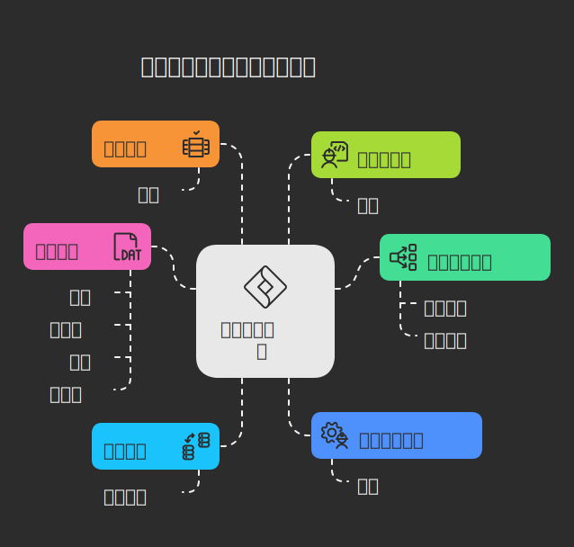

# 💡 Napkin：用可视化脑图构建你的知识网络

## 🛠️ 工具简介

**Napkin** 是一款专注于**知识碎片收集与可视化管理**的 AI 工具，它通过智能联想和动态脑图，让你的想法自然生长为一张“知识网络”，帮助你更系统地整理思维、激发灵感。
可以把一段文字一键变成思维导图。

---

## 🎯 主要功能

| 功能         | 说明                          |
|------------|-----------------------------|
| ✍️ 碎片笔记收集  | 支持快速记录灵感、想法、引文等片段内容         |
| 🔗 智能连接    | 自动识别笔记之间的语义关联，构建知识网络        |
| 🧠 可视化脑图   | 将所有笔记以节点图谱形式展现，支持点击展开相关内容   |
| 🤖 AI 灵感推荐 | 每日为你推荐与当前知识相关的内容，启发新想法      |
| 🗂️ 标签管理   | 支持主题归类、标签筛选，方便聚焦一个方向深入思考    |
| 📤 内容导出    | 将多个笔记组合导出为文章初稿或 Markdown 文件 |

---

## 🧩 解决什么问题？

Napkin 针对的是**知识管理碎片化与灵感沉没**的问题：

- 📌 **灵感很多但散乱**：日常记录的零碎内容难以系统整合，难以回顾或重新激活。
- 🔍 **找不到联系**：多个想法之间缺乏可视化的连接，不易形成体系。
- 🧠 **缺乏整理思维的工具**：现有笔记工具偏重“存储”，而不是“连接”和“启发”。

Napkin 的“脑图+联想”机制，正是为了解决这类问题。

---

## 🌐 官方网站
[https://app.napkin.ai/](https://app.napkin.ai/)

---

## ✍️ 博主使用感受
### 使用案例
最近这两天正在进行软考备战，就将自己整理的部分笔记输入到Napkin中，笔记内容如下:
```text
软件架构设计主要以下阶段：
1. 需求分析阶段
需求会建立模型： 逻辑模型（系统应该做什么，软件开发阶段可以使用UML：动态图表示，用例图、活动图、序列图） 不设计具体的实现细节
架构设计阶段：物理模型（关注与如何实现需求，包括软件部署、技术选型、系统配置、硬件资源）
站在更技术的角度实现
重点有以下几点:
● 逻辑模型与物理模型转化？(用例模型)
● 转化后的模型可追溯？（表格或者用例Map）
● 如何根据需求模型构建SA模型？

2. 设计阶段（关注最多）
  a. SA模型描述（构件与连接子（构件之间的互联机制））
  b. SA模型的设计与分析方法
  c. SA设计经验总结与复用
     ADL：体系结构描述语言（架构描述语言），用来支持构件、连接子与其配置的描述语言
     Component： 构件是系统中的一个独立的、功能性的单元，通常封装了实现某种功能的逻辑
     Connector： 连接子用于描述构件之间如何互相连接和交互。这些连接子不仅仅是简单的数据流和控制流，它们可以封装复杂的交互模式，例如同步/异步通信、数据转换、负载均衡和故障处理等。连接子的定义使得系统的通信机制可以独立于构件的具体实现，从而提高系统的可扩展性和可维护性。
     Configuration：配置描述的是系统中各个构件和连接子如何布局（组织）以及它们之间的交互关系。在ADL中，配置通常定义了一个具体的架构拓扑，说明了哪些构件和连接子存在，以及它们如何配合工作。配置可以视为构件和连接子的实例及其相互关系的具体化
     多视角：从不同面描述SA，关注点分离
   4+1 视角：
    逻辑视图：系统有什么模块和功能
    开发视图：描述系统模块的组织结构和软件源代码的组织方式
    进程视图：关注系统运行时，组件和组件之间如何交互
    物理视图：系统软件如何在硬件部署
    场景：  通过用例或者场景验证上面4个视图的完整性和有效性
3. 实现阶段
4. 构建组装阶段
5. 部署阶段
6. 后开发阶段
```
然后进行生成，支持多种思维脑图，我选取了一个思维导图，内容如下图所示:  


生成的思维脑图只是初版本，可以载此基础上进行修改加工，非常适合用来创作！

### 博主使用感受
1. **操作简单、零门槛上手**  
   无需安装任何软件，复制粘贴文字即可开始生成脑图，整体体验非常顺滑，适合不想被复杂功能打扰的用户。

2. **生成结构清晰，适配多种思维表达**  
   无论是用于梳理知识要点、整理阅读笔记，还是构思创作框架，自动生成的脑图结构都足够丰富，能很好地支持不同的表达需求。

3. **视觉效果优秀，图本身就是“作品”**  
   自动生成的思维导图在布局、配色、图标细节等方面都相当讲究，整体观感非常舒服，不仅实用，也具备一定的视觉美感，可直接用于展示或分享。

---
