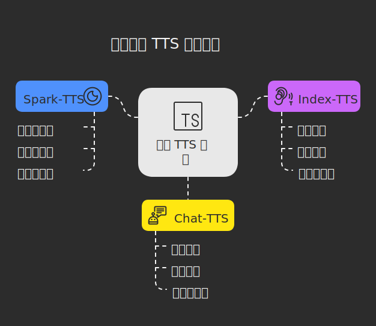

# 探索三大开源 TTS 工具：Spark-TTS、Index-TTS 和 Chat-TTS
文本转语音（Text-to-Speech, TTS）技术正改变着我们的生活，从智能助手到内容创作，TTS 的应用无处不在。今天，我们将深入剖析三款开源 TTS 工具——**Spark-TTS**、**Index-TTS** 和 **Chat-TTS**，探讨它们的特点、应用场景，以及是否支持本地部署和音色克隆功能。

---

## 1. Spark-TTS：开源与零样本克隆的先锋

### 简介
[Spark-TTS](https://github.com/SparkAudio/Spark-TTS) 是由 SparkAudio 团队开发的一款开源 TTS 工具，基于大型语言模型（如 Qwen2.5）构建。它以高效、高质量的语音合成和零样本音色克隆能力著称，适用于多种场景。

### 特点
- **零样本音色克隆**：只需提供几秒钟的参考音频，无需训练即可复刻目标音色。
- **多语言支持**：支持中英文双语，并具备跨语言合成能力。
- **细粒度控制**：可调节音调、语速、性别等参数，生成多样化虚拟声音。
- **开源透明**：代码托管在 GitHub，提供详细文档和社区支持。
- **高效推理**：支持在低配 CPU 上运行，适合本地部署。

### 应用场景
- **内容创作**：如有声书、播客，快速生成自然语音。
- **智能助手**：为虚拟助手提供个性化语音输出。
- **配音需求**：适用于视频、游戏等场景的快速配音。
- **技术研究**：开源特性让开发者能深入探索 TTS 技术。

### 本地部署与音色克隆
- **本地部署**：支持，完全开源，用户可从 GitHub 下载代码并在本地运行（支持 Windows、Mac、Linux）。
- **音色克隆**：支持零样本克隆，用户可上传个人语音音频，直接生成相似音色。

---

## 2. Index-TTS：工业级 TTS 的新选择

### 简介
[Index-TTS](https://github.com/index-tts/index-tts) 是一个基于 XTTS 和 Tortoise 优化的工业级 TTS 系统。它通过模块改进和大规模数据训练，在自然度、音色克隆和中文发音准确性上表现出色。

### 特点
- **中文拼音控制**：支持字符与拼音混合输入，解决多音字问题（如“长 cháng” vs “长 zhǎng”）。
- **模块优化**：采用 Conformer 编码器和 BigVGAN2 解码器，提升音质和音色相似度。
- **大规模训练**：基于数万小时数据，词错误率（WER）优于 XTTS 和 CosyVoice2。
- **零样本能力**：仅需短音频即可实现音色克隆。

### 应用场景
- **工业应用**：如智能客服、语音导航，提供稳定、高质量语音。
- **内容创作**：适用于配音、有声读物等场景。
- **个性化语音**：克隆用户声音，生成定制化输出。

### 本地部署与音色克隆
- **本地部署**：支持，开源代码可从 GitHub 获取并部署。
- **音色克隆**：支持零样本克隆，用户可上传语音生成相似音色。

---

## 3. Chat-TTS：对话场景的语音专家

### 简介
[Chat-TTS](https://github.com/2noise/ChatTTS) 是一款专为对话设计的开源 TTS 工具，通过10万小时的中英文数据训练，特别适合为聊天机器人或虚拟助手生成自然、情感丰富的语音。

### 特点
- **对话优化**：注重自然度和情感表达，支持笑声、停顿等细节。
- **多语言支持**：中英文合成质量高，表现均衡。
- **可控性强**：可调整语调、韵律，增强对话真实感。
- **社区活跃**：GitHub 上 Star 数快速增长，更新频繁。

### 应用场景
- **虚拟助手**：为智能客服或聊天机器人提供逼真语音。
- **多媒体内容**：生成对话式视频或音频。
- **教育娱乐**：适用于语言学习或游戏角色配音。

### 本地部署与音色克隆
- **本地部署**：支持，开源代码可本地运行。
- **音色克隆**：部分支持，需通过微调上传个人语音实现定制化音色。

---

## 对比表格
| 工具      | 核心亮点                     | 适用场景             | 本地部署 | 音色克隆支持     |
| --------- | ---------------------------- | -------------------- | -------- | ---------------- |
| Spark-TTS | 零样本克隆、多语言支持       | 内容创作、助手、研究 | ✅ 是     | ✅ 支持（零样本） |
| Index-TTS | 拼音控制、工业级模型、中文强 | 工业语音、定制配音   | ✅ 是     | ✅ 支持（零样本） |
| Chat-TTS  | 情感表达优化、对话拟人化     | 虚拟助手、互动内容   | ✅ 是     | ⚠️ 支持微调实现   |

---

## 🧭 如何选择适合你的 TTS 工具？

- 想快速“复刻”自己的声音？选 Spark-TTS 或 Index-TTS。
- 中文发音准确性优先？Index-TTS 表现更稳定。
- 服务型对话语音？Chat-TTS 最贴近真实。
- 担心隐私？三款工具均支持本地运行。

---

## 获取与体验
这三款工具均提供开源代码，具体地址如下：
- **Spark-TTS**: [GitHub](https://github.com/SparkAudio/Spark-TTS)
- **Index-TTS**: [GitHub](https://github.com/index-tts/index-tts)
- **Chat-TTS**: [GitHub](https://github.com/2noise/ChatTTS)

## 总结  
Spark-TTS 和 Index-TTS 适合零样本克隆爱好者，而 Chat-TTS 则是对话场景的理想选择。  

