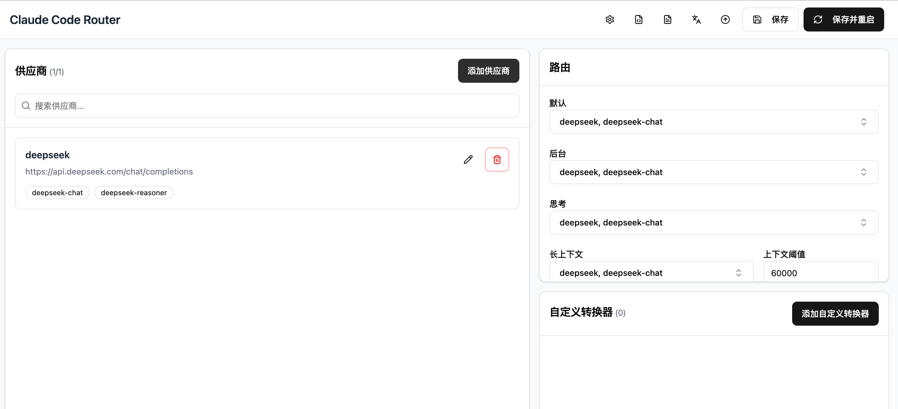

1. 下载安装nvm
```shell
curl -o- https://raw.githubusercontent.com/nvm-sh/nvm/v0.39.3/install.sh | bash
source ~/.zshrc
nvm install 20
nvm install 28
nvm use 20
# 注意如果安装软件 node版本不对 请卸载系统node版本，避免nvm冲突
#homebrew uninstall node@18
```

2. 安装node环境
```shell
source ~/.zshrc
nvm use 20
node version
```

3. 安装claude-code和claude-code-router
```shell
npm install -g @anthropic-ai/claude-code
npm install -g @musistudio/claude-code-router
```

4. 配置国产大模型
```shell
ccr ui
```
访问: 
选择国产模型->配置密钥->保存->添加路由->保存并重启

5. 启动
```shell
ccr code
```

