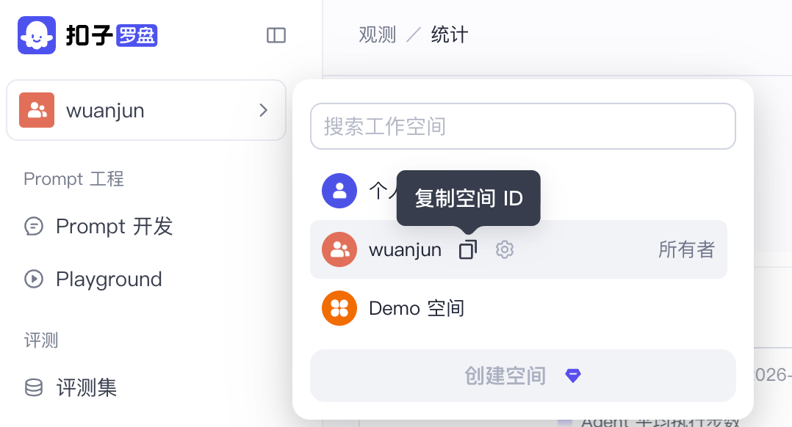
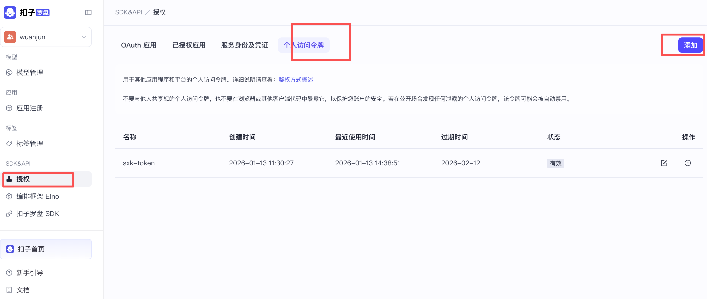
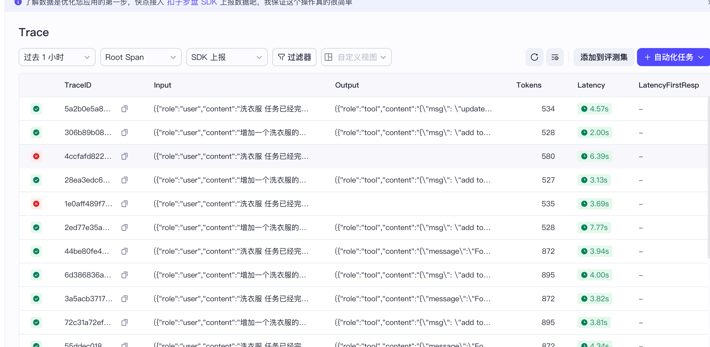
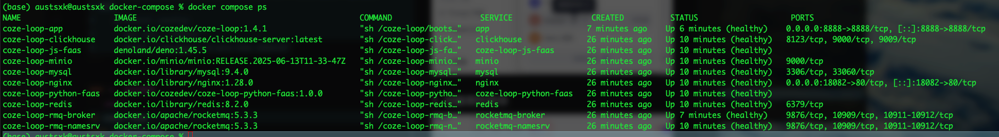
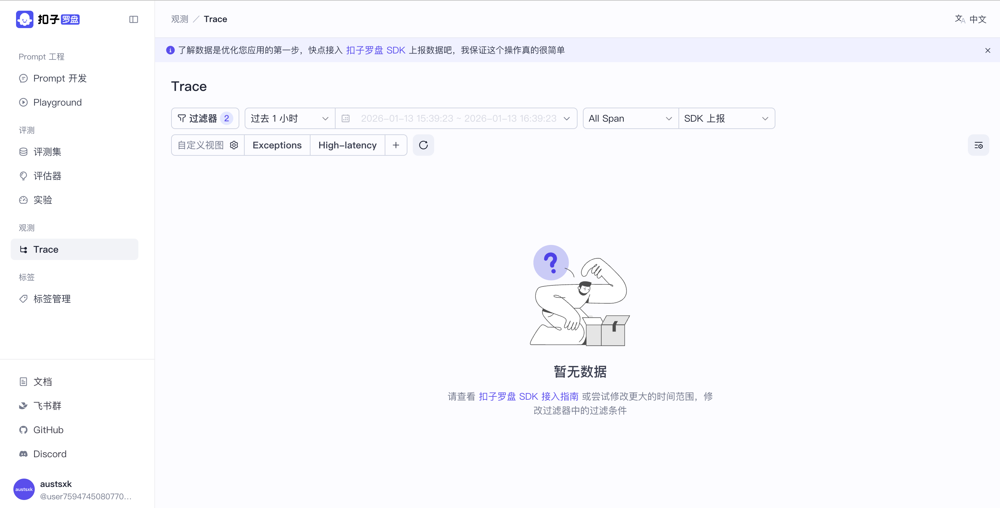
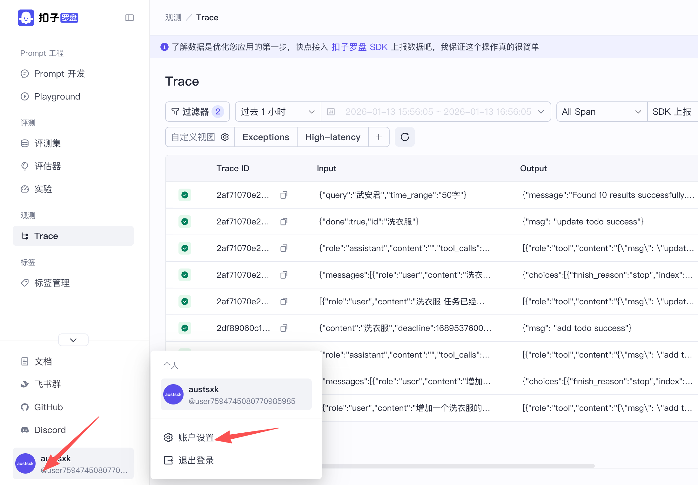
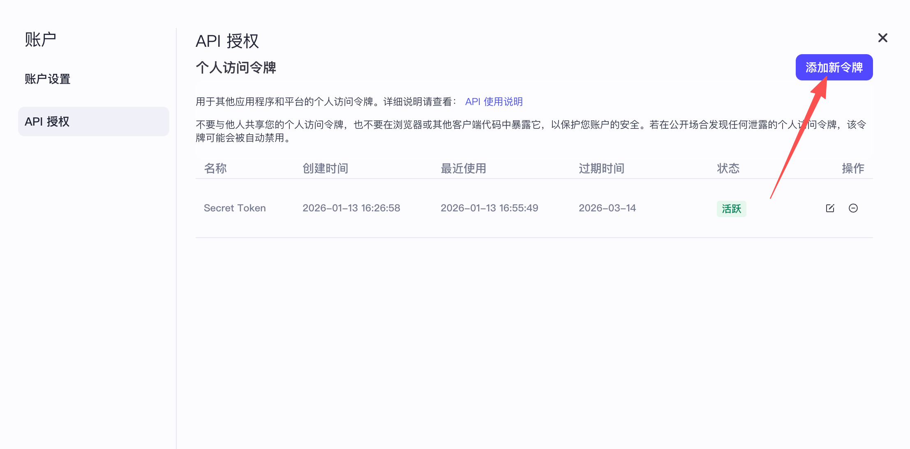
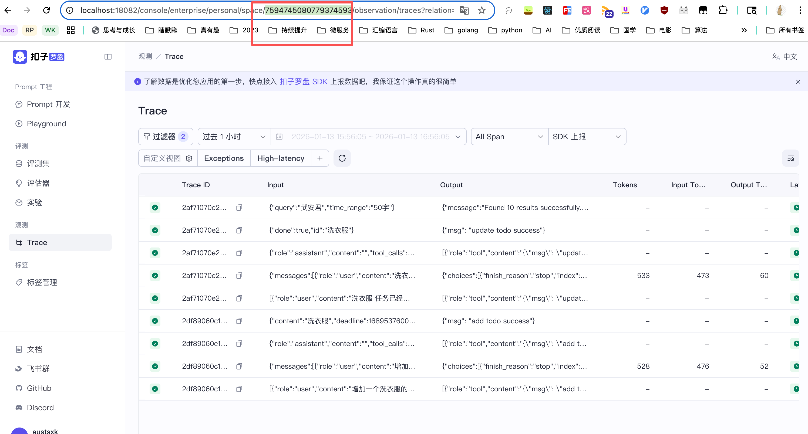
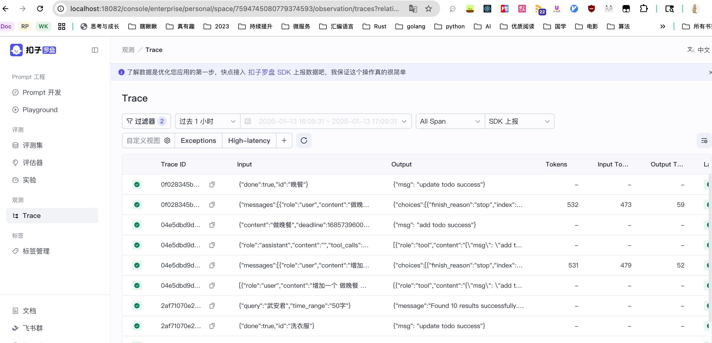

# Coze-Loop 本地搭建和Trace使用

## 一、[云端使用](https://loop.coze.cn/)
### 1. 创建空间并获取空间ID


### 2. 创建授权密钥


### 3. [Eino配置Trace](https://loop.coze.cn/open/docs/developer_guides/authentication)
```go
os.Setenv("COZELOOP_WORKSPACE_ID", "space_id")
os.Setenv("COZELOOP_API_TOKEN", "token")
cozeloopApiToken := os.Getenv("COZELOOP_API_TOKEN")
cozeloopWorkspaceID := os.Getenv("COZELOOP_WORKSPACE_ID")

var handlers []callbacks.Handler
client, err := cozeloop.NewClient(
    cozeloop.WithAPIToken(cozeloopApiToken),
    cozeloop.WithWorkspaceID(cozeloopWorkspaceID),
)
if err != nil {
    panic(err)
}
defer client.Close(ctx)
handlers = append(handlers, clc.NewLoopHandler(client))
```

### 4. 追踪结果


---

## 二、[本地搭建](https://github.com/coze-dev/coze-loop)
### 1. [去火山方舟获取豆包配置](https://console.volcengine.com/ark/region:ark+cn-beijing/model/detail?Id=doubao-1-5-pro-32k)


### 2. 下载源代码
```shell
git clone https://github.com/coze-dev/coze-loop.git
```

### 3. 修改大模型配置
```shell
cd coze-loop
cd release/deployment/docker-compose/conf/model_config.yaml
# 编辑
#    protocol_config:
#      api_key: "你的ak"
#      model: "doubao-1-5-pro-32k-250115"
```

### 4. 启动服务
```shell
cd coze-loop
make compose-up
```

### 5. 服务状态


### 6. 测试服务
访问: http://localhost:8082/  


### 7. 配置Trace
#### 1. 创建授权密钥
  

#### 2. 获取默认空间SpaceId(请复制浏览器连接，在路由中获取)


### 8. 代码配置Callback
```go
ctx := context.Background()
	var handlers []callbacks.Handler
	if cozeloopApiToken != "" {
		client, err := cozeloop.NewClient(
			cozeloop.WithAPIBaseURL("http://localhost:8888/"),
			cozeloop.WithAPIToken(cozeloopApiToken),
			cozeloop.WithWorkspaceID(cozeloopWorkspaceID),
		)
		if err != nil {
			panic(err)
		}
		defer client.Close(ctx)
		handlers = append(handlers, clc.NewLoopHandler(client))
	}
	callbacks.AppendGlobalHandlers(handlers...)
```

### 9. 追踪结果


### 10. 完整的Eino代码演示
```go
package main

import (
	"context"
	"fmt"
	"github.com/cloudwego/eino-examples/internal/logs"
	clc "github.com/cloudwego/eino-ext/callbacks/cozeloop"
	"github.com/cloudwego/eino-ext/components/model/ollama"
	"github.com/cloudwego/eino-ext/components/tool/duckduckgo/v2"
	"github.com/cloudwego/eino/callbacks"
	"github.com/cloudwego/eino/components/tool"
	"github.com/cloudwego/eino/components/tool/utils"
	"github.com/cloudwego/eino/compose"
	"github.com/cloudwego/eino/schema"
	"github.com/coze-dev/cozeloop-go"
	"os"
)

func main() {
	// 本地部署的CozeLoop的空间ID和密钥
	cozeloopApiToken := os.Getenv("COZELOOP_API_TOKEN")
	cozeloopWorkspaceID := os.Getenv("COZELOOP_WORKSPACE_ID") // http://localhost:18082/ 本人需要端口8082->18082
	ctx := context.Background()
	var handlers []callbacks.Handler
	if cozeloopApiToken != "" && cozeloopWorkspaceID != "" {
		client, err := cozeloop.NewClient(
			cozeloop.WithAPIBaseURL("http://localhost:8888/"),
			cozeloop.WithAPIToken(cozeloopApiToken),
			cozeloop.WithWorkspaceID(cozeloopWorkspaceID),
		)
		if err != nil {
			panic(err)
		}
		defer client.Close(ctx)
		handlers = append(handlers, clc.NewLoopHandler(client))
	}
	callbacks.AppendGlobalHandlers(handlers...)

	updateTool, err := utils.InferTool("update_todo", "Update a todo item, eg: content,deadline...", UpdateTodoFunc)
	if err != nil {
		logs.Errorf("InferTool failed, err=%v", err)
		return
	}

	// 创建DuckDuckGo工具用来联网搜索
	searchTool, err := duckduckgo.NewTextSearchTool(ctx, &duckduckgo.Config{})
	if err != nil {
		logs.Errorf("NewTextSearchTool failed, err=%v", err)
		return
	}

	// 初始化 tools
	todoTools := []tool.BaseTool{
		getAddTodoTool(), // 使用 NewTool 方式
		updateTool,       // 使用 InferTool 方式
		&ListTodoTool{},  // 使用结构体实现方式, 此处未实现底层逻辑
		searchTool,
	}

	// 创建并配置 ChatModel 本次测试使用ollama本地部署的模型 qwen2.5 支持tools调用
	chatModel, err := ollama.NewChatModel(ctx, &ollama.ChatModelConfig{
		BaseURL: "http://localhost:11434", // Ollama 服务地址
		Model:   "qwen2.5:7b",             // 模型名称
	})

	if err != nil {
		logs.Errorf("NewChatModel failed, err=%v", err)
		return
	}

	// 获取工具信息, 用于绑定到 ChatModel
	toolInfos := make([]*schema.ToolInfo, 0, len(todoTools))
	var info *schema.ToolInfo
	for _, todoTool := range todoTools {
		info, err = todoTool.Info(ctx)
		if err != nil {
			logs.Infof("get ToolInfo failed, err=%v", err)
			return
		}
		toolInfos = append(toolInfos, info)
	}

	// 将 tools 绑定到 ChatModel
	err = chatModel.BindTools(toolInfos)
	if err != nil {
		logs.Errorf("BindTools failed, err=%v", err)
		return
	}

	// 创建 tools 节点
	todoToolsNode, err := compose.NewToolNode(ctx, &compose.ToolsNodeConfig{
		Tools: todoTools,
	})
	if err != nil {
		logs.Errorf("NewToolNode failed, err=%v", err)
		return
	}

	// 构建完整的处理链
	chain := compose.NewChain[[]*schema.Message, []*schema.Message]()
	chain.
		AppendChatModel(chatModel, compose.WithNodeName("chat_model")).
		AppendToolsNode(todoToolsNode, compose.WithNodeName("tools"))

	// 编译并运行 chain
	agent, err := chain.Compile(ctx)
	if err != nil {
		logs.Errorf("chain.Compile failed, err=%v", err)
		return
	}

	// 运行示例
	resp, err := agent.Invoke(ctx, []*schema.Message{
		{
			Role:    schema.User,
			Content: "增加一个 做晚餐 的任务，要在今天下午4点开始,今天晚上20点完成，是最后时间",
		},
	})
	if err != nil {
		logs.Errorf("agent.Invoke failed, err=%v", err)
		return
	}

	// 输出结果
	for idx, msg := range resp {
		logs.Infof("\n")
		logs.Infof("message %d: %s: %s", idx, msg.Role, msg.Content)
	}

	// 更新
	resp2, err := agent.Invoke(ctx, []*schema.Message{
		{
			Role:    schema.User,
			Content: "我已经完成做晚餐的任务，请帮我更新。给我搜索一下武安君是谁?限制50个字",
		},
	})
	if err != nil {
		logs.Errorf("agent.Invoke failed, err=%v", err)
		return
	}

	// 输出结果
	for idx, msg := range resp2 {
		logs.Infof("\n")
		logs.Infof("message %d: %s: %s", idx, msg.Role, msg.Content)
	}
}

// 获取添加 todo 工具
// 使用 utils.NewTool 创建工具
func getAddTodoTool() tool.InvokableTool {
	info := &schema.ToolInfo{
		Name: "add_todo",
		Desc: "Add a todo item",
		ParamsOneOf: schema.NewParamsOneOfByParams(map[string]*schema.ParameterInfo{
			"content": {
				Desc:     "The content of the todo item",
				Type:     schema.String,
				Required: true,
			},
			"started_at": {
				Desc: "The started time of the todo item, in unix timestamp",
				Type: schema.Integer,
			},
			"deadline": {
				Desc: "The deadline of the todo item, in unix timestamp",
				Type: schema.Integer,
			},
		}),
	}

	return utils.NewTool(info, AddTodoFunc)
}

// ListTodoTool
// 获取列出 todo 工具
// 自行实现 InvokableTool 接口
type ListTodoTool struct{}

func (lt *ListTodoTool) Info(_ context.Context) (*schema.ToolInfo, error) {
	return &schema.ToolInfo{
		Name: "list_todo",
		Desc: "List all todo items",
		ParamsOneOf: schema.NewParamsOneOfByParams(map[string]*schema.ParameterInfo{
			"finished": {
				Desc:     "filter todo items if finished",
				Type:     schema.Boolean,
				Required: false,
			},
		}),
	}, nil
}

type TodoUpdateParams struct {
	ID        string  `json:"id" jsonschema_description:"id of the todo"`
	Content   *string `json:"content,omitempty" jsonschema_description:"content of the todo"`
	StartedAt *int64  `json:"started_at,omitempty" jsonschema_description:"start time in unix timestamp"`
	Deadline  *int64  `json:"deadline,omitempty" jsonschema_description:"deadline of the todo in unix timestamp"`
	Done      *bool   `json:"done,omitempty" jsonschema_description:"done status"`
}

type TodoAddParams struct {
	Content  string `json:"content"`
	StartAt  *int64 `json:"started_at,omitempty"` // 开始时间
	Deadline *int64 `json:"deadline,omitempty"`
}

func (lt *ListTodoTool) InvokableRun(_ context.Context, argumentsInJSON string, _ ...tool.Option) (string, error) {
	logs.Infof("invoke tool list_todo: %s", argumentsInJSON)
	return `{"todos": [{"id": "1", "content": "在2024年12月10日之前完成Eino项目演示文稿的准备工作", "started_at": 1717401600, "deadline": 1717488000, "done": false}]}`, nil
}

func AddTodoFunc(_ context.Context, params *TodoAddParams) (string, error) {
	logs.Infof("invoke tool add_todo: %+v", params)
	job := fmt.Sprintf("任务: %s 添加成功，开始时间为：%v，截止时间为：%v \n", params.Content, *params.StartAt, *params.Deadline)
	fmt.Println(job)
	return `{"msg": "add todo success"}`, nil
}

func UpdateTodoFunc(_ context.Context, params *TodoUpdateParams) (string, error) {
	logs.Infof("invoke tool update_todo: %+v", params)
	fmt.Printf("任务: %s ✅", params.ID)
	return `{"msg": "update todo success"}`, nil
}

```

输出:
```text
[INFO] 2026-01-13 17:24:38 invoke tool add_todo: &{Content:做晚餐 StartAt:0x140002422f0 Deadline:0x140002422e8}
任务: 做晚餐 添加成功，开始时间为：1685937600，截止时间为：1685976000 

[INFO] 2026-01-13 17:24:38 

[INFO] 2026-01-13 17:24:38 message 0: tool: {"msg": "add todo success"}
[INFO] 2026-01-13 17:24:42 invoke tool update_todo: &{ID:做饭任务ID Content:0x1400024a290 StartedAt:<nil> Deadline:0x1400058e240 Done:0x1400058e248}
任务: 做饭任务ID ✅[INFO] 2026-01-13 17:24:44 

[INFO] 2026-01-13 17:24:44 message 0: tool: {"msg": "update todo success"}
[INFO] 2026-01-13 17:24:44 

[INFO] 2026-01-13 17:24:44 message 1: tool: {"message":"Found 10 results successfully.","results":[{"title":"武安君_百度百科","url":"https://baike.baidu.com/item/%E6%AD%A6%E5%AE%89%E5%90%9B/10689774","summary":"武安君是中国古代封君名号，\"武安\"意为以武功安邦，\"君\"为卿大夫爵号，需满足封地及臣属条件 [1]。战国时期开始盛行，授予安邦克敌者，既作勋号也作封地名 [6-7]。秦国名将 白起 因战功受封为武安君，成为首位获此称号者 [2] [3]。"},{"title":"史上四位武安君：三人被杀，一人自杀，战国死亡率最高的封号 - 知乎","url":"https://zhuanlan.zhihu.com/p/691051318","summary":"true 在战国之后，武安君的封号就再也没有给任何人，这主要就是因为这四个人的悲剧人生。苏秦是第一位武安君，苏秦在当时是非常有能力的一个人，他一个人做了韩赵魏齐楚燕六个国家的国相，一个人挂着六国的相印这在当时是非常少见的。 但是苏秦因为和燕国有了矛盾，于是主动请缨去齐国做 ..."},{"title":"武安君 - 维基百科，自由的百科全书","url":"https://zh.wikipedia.org/zh-hans/%E6%AD%A6%E5%AE%89%E5%90%9B","summary":"武安君 为一个 封君 之 爵位。 张守节 《史记正义》：\"言能抚养军士，战必克，得百姓安集，故号 武安。\"乃以\"武\"\"安\"民之意。 武安君 在 春秋战国 时代，常为功臣名将所得之封号。 可以指： 六国 拜相的 纵横家： 苏秦。 秦国 之武安君： 白起。 赵国 之武安君： 李牧。 楚国 之武安君 ..."},{"title":"战国四大武安君，个个战功显赫却没一个善终_李牧和_秦国_苏秦","url":"https://www.sohu.com/a/946344726_122388903","summary":"历史上最为人知的几位\"武安君\"，包括白起、苏秦、李牧和项燕。公元前225年，秦国派出李信领兵20万进攻楚国，项燕联合反秦势力昌平君展开夹击，在这场战斗中，项燕不仅打败了李信，还斩杀了秦军7位都尉，为楚国赢得了…"},{"title":"武安君-快懂百科 - m.baike.com","url":"https://m.baike.com/wikiid/8204964485034045303","summary":"[6] 各国封君中，最重要的是有功的将相大臣，这些有功的将相大臣，有经过政治和军事斗争的考验而选拔出来的，也有原来是国君亲属出身的。 如武安君 白起，就是由于军功而得封。 [5] 武安 是战国时城市名，在今 ..."},{"title":"战国时期有四位武安君，他们是谁？有哪些功绩？_趣历史网","url":"https://baike.qulishi.com/articles/v546146.html","summary":"血色疆场终章：四征安南三征蒙古的张辅，何以陨落土木堡？ 血色浪漫：项羽\"坑降\"暴行与\"霸王别姬\"的永恒张力 推恩令：汉武帝瓦解诸侯的\"温柔利刃\" 王皇后：从共患难到被废黜的宫廷悲剧 红楼称谓考：王夫人的姓名密码与身份隐喻 斯巴达真的300人打几万人吗？历史真相与叙事重构 察必 ..."},{"title":"武安君 - 搜狗百科","url":"https://baike.sogou.com/m/v618770.htm","summary":"武安君是古代国君对功勋卓著的大将军的封号，是一种高等爵位。 它最早出自西周，意思是以武功治世、威信安邦，历朝历代国之能安邦胜敌者均号\"武安\" [1]。其代表人物有 白起 、李牧、 项燕 等。"},{"title":"战国四大武安君，个个战功显赫却没一个善终 - 知乎","url":"https://zhuanlan.zhihu.com/p/419008374","summary":"武安君是先秦时期的一种封号，在战乱时期，国军以武功安天下，手下的将领如果功勋卓著都可以获得武安君的封号，然而在人才辈出的战国时代也仅有寥寥数人获得了武安君的封号，这也从侧面反映出武安君封号的含金量之高。其中最出名的要数白起、苏秦、李牧和项燕。 1、白起 白起，有\"人屠 ..."},{"title":"战国有三位\"武安君\"：除了白起，另外两位分别是谁？|秦国|李牧|苏秦|秦军|王翦|春秋战国_网易订阅","url":"https://www.163.com/dy/article/HNDADN1Q05560BAL.html","summary":"从整体上来看，白起担任秦军主将30多年，攻城70余座，为秦始皇一统六国做出了巨大的贡献，受封为武安君。 在最终的结局上，白起因为功高震主，得罪应侯，接连贬官。"},{"title":"盘点历史上四名武安君，都是战国名将，除了白起还有谁","url":"https://www.sohu.com/a/691118773_121660184","summary":"武安君，古代封号名。武安者，以武功治世、威信安邦誉名。历朝历代国之能安邦胜敌者均号\"武安\"。君是一种爵号。今天就盘点历史上四名武安君，都是战国名将。 白起 一、白起（？—公元前257年），白氏，名起，郿邑（今陕西眉县）人。战国时期名将。 秦昭王时期，秦国国力强大，图谋天下 ..."}]}

```