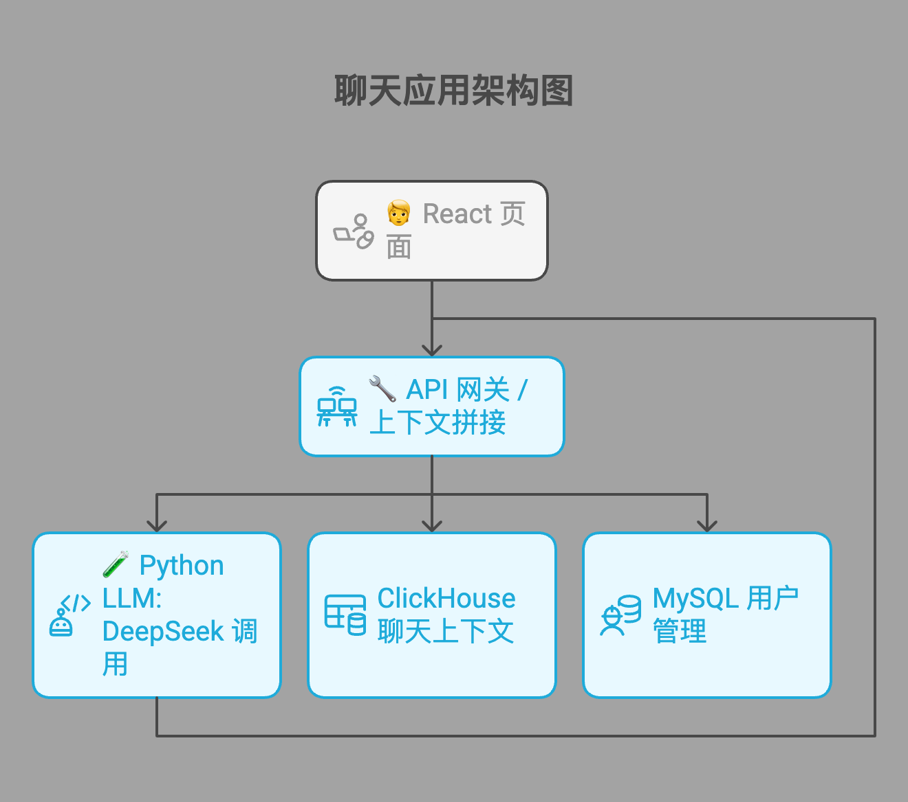

# 🤖 Chatbot Platform · 基于 Go 网关 + DeepSeek 推理的多容器聊天系统

## 📌 项目简介

本项目是一个完整的**AI 聊天机器人系统**，采用模块化微服务架构，支持 DeepSeek 大模型接入，具备以下能力：

- 前端：React 聊天页面，支持流式展示模型回复
- 网关：Go 实现的服务中台，负责上下文拼接、调用调度
- 模型服务：Python + LangChain 封装 DeepSeek API，支持流式响应
- 数据存储：
  - Chat 内容：ClickHouse（支持上下文快速回查）
  - 用户信息：MySQL（账号、权限、登录令牌）

本系统基于 Docker Compose 实现一键部署，后续支持 K8s 弹性扩展。

---

## 🧱 系统架构图


## 目录说明
```text
chatbot/
├── README.md                  # 项目说明文档
├── docker-compose.yml         # 本地多容器启动
├── .env                       # 通用配置变量（API Key / BaseURL）
├── deploy/                    # 部署相关（后期可扩展 Helm/K8s）
│   ├── dev/                   # 本地测试用 Dockerfile & compose override
│   ├── prod/                  # K8s yaml / Helm chart（未来可加）
│   ├── nginx/                 # 静态服务部署配置（如前端）
│   └── init-sql/              # 初始数据库建表 SQL（MySQL / ClickHouse）
├── frontend/                  # 前端代码（React/Vite）
│   ├── public/
│   ├── src/
│   ├── Dockerfile             # 前端构建容器
│   └── vite.config.ts
├── gateway-go/                # Go 网关服务
│   ├── cmd/                   # 启动命令目录 main.go
│   ├── internal/              # 按功能模块拆分，符合 Go module 规范
│   │   ├── handler/           # HTTP handler：Chat, Session
│   │   ├── model/             # 请求/响应/存储结构体
│   │   ├── dao/               # 数据访问封装
│   │   ├── llmclient/         # LLM RPC客户端封装
│   │   └── config/            # 环境配置解析
│   ├── go.mod
│   ├── Dockerfile
│   └── Makefile               # 构建/测试脚本
├── llm-python/                # Python LLM服务
│   ├── app/                   # FastAPI + LangChain 调用逻辑
│   │   ├── main.py
│   │   ├── service.py         # DeepSeek封装
│   │   └── schema.py          # 请求响应结构
│   ├── requirements.txt
│   ├── Dockerfile
│   └── pyproject.toml         # （可选 poetry）
├── scripts/                   # 初始化脚本 / 测试脚本
│   └── seed_data.py
└── .github/                   # GitHub Actions CI/CD配置（可选）
    └── workflows/
```