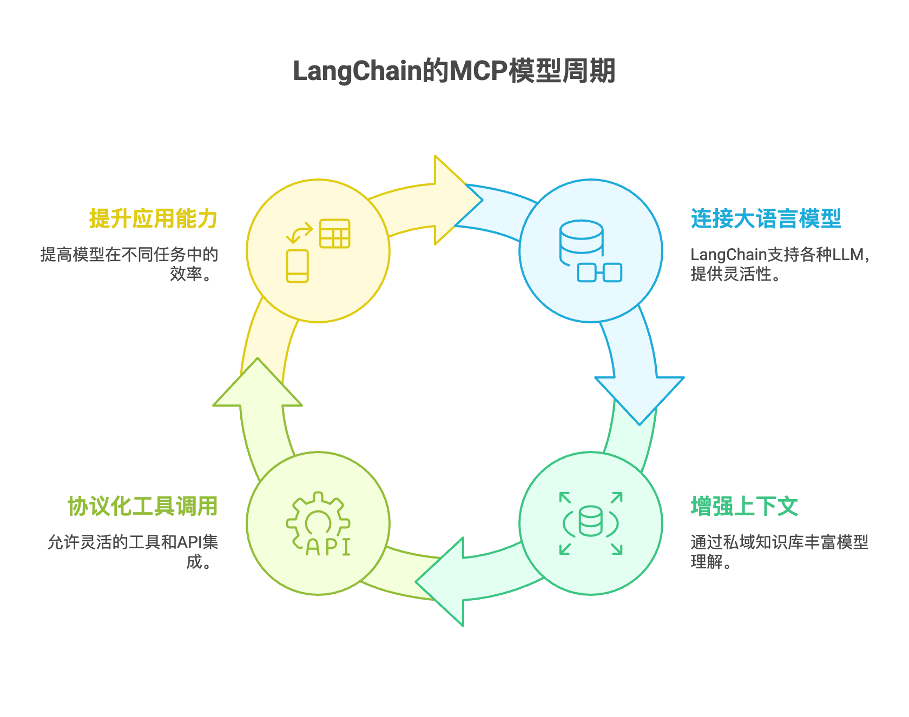

# 🌟 从大语言模型到 LangChain：从零开始

作者：武安君 
时间：2025-05-28  
关键词：LangChain、大语言模型、RAG、Agent、私域知识、LLM

---

## ✨ 一、什么是LLM  
> 大语言模型（Large Language Model，LLM）是近年来人工智能最核心的突破之一。LLM 是一种基于深度学习的预测模型，它通过学习海量文本数据，在给定上下文
的条件下预测下一个 token，从而实现自然语言理解与生成。 目前主流的大模型（如 GPT-4o、Claude 3.5、DeepSeek-R1）均为多模态或文本-语言能力极强的
LLM，其背后拥有上百亿甚至千亿的参数量，训练所需资源极其庞大。大模型本身是"静态"的，它训练完成后知识就被固定在模型权重中，要想"活"起来，就必须接入实时
数据、外部工具、私有知识库。

---
## 🛠 二、LangChain是什么
> LangChain 是一个框架，专门用来连接大语言模型和外部世界。也就是说，LLM是"大脑"，LangChain是"大脑的手脚和工具带"。

LangChain的核心目标是可以理解为一个典型的MCP模型架构:    
- M-Model（大语言模型）：对接各类 LLM，包括 GPT-4o、Claude、Llama、本地模型等
- C-Context（上下文）：通过私域知识库（PDF/文本/数据库/网页等）+ 向量化技术（RAG）实现增强型上下文注入
- P-Protocol（协议化工具调用流程）：将外部工具、函数、API 注册为 Agent 可调度的组件，构建可观察、可调试、可扩展的调用链

---

## 📚 三、我对LangChain的理解
> LangChain是大模型落地应用的连接器，它通过将外部数据（文档、API、函数）与 LLM 结合，帮助构建具备“记忆、行动、搜索”能力的智能应用。

### ✅ 核心能力概括如下：

| 能力模块   | 说明                                                         |
|------------|--------------------------------------------------------------|
| 模型接入   | 支持 OpenAI、Claude、Llama、本地模型等                      |
| RAG 架构   | 支持私域文档切分、向量化、结合输入做上下文增强              |
| Tool 调用  | 将本地函数或外部 API 封装为可调用工具                       |
| Agent 机制 | 支持任务分解、角色设定、多步骤自动调用，构建 Agent 系统     |
| 记忆管理   | 支持上下文持久化、聊天记忆、变量跟踪                        |
| 多 Agent   | 支持 CrewAI / AutoGen 等方式的多智能体协作                  |

---

## 🤖 四、为什么要用 LangChain 而不是直接调 OpenAI 接口？
直接使用OpenAI的ChatGPT API可以实现对话功能，但存在以下弊端：
- 它不会自动记住用户的历史指令
- 它无法主动调用函数或执行本地脚本
- 它不能访问外部私有知识

而 LangChain 提供了：
- prompt 模板管理
- memory 管理机制
- 工具注册机制
- agent 调度策略
- 工程化开发结构
从而可以轻松构建出具备"记忆 + 工具能力 + 动态决策"的复杂LLM应用。

---

## 🧠 五、总结
通过这一阶段的初步理解，我认为大模型是内核，LangChain是连接现实的操作系统。真正的智能，不在模型本身，而在如何调度它完成真实世界的任务。包括但
不限于以下几点：
- 学LangChain，不是学模型，而是如何让大模型和真实业务进行结合实现项目落地
- LangChain就像云原生的容器编排，可以编排数据、工具、接口、大模型
- 模型接入不止是OpenAI，也支持 DeepSeek、本地模型，甚至私有模型推理模块，也可以使用开源的Hugging Face Transformers库

### 🛠 六、下一步
- 完成API调用与工具封装
- 搭建一个支持上下文的GPT问答Bot
- 集成一个天气查询或本地计算函数作为Tool