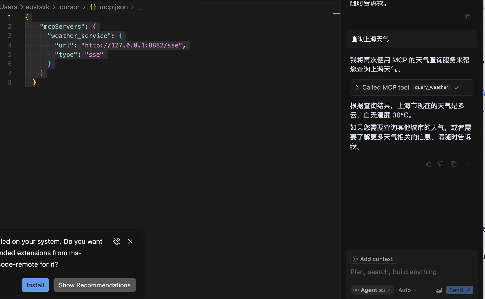

# 初窥MCP：大模型的"USB-C"接口

## 什么是MCP？
> MCP，全称**Model Context Protocol**（模型上下文协议），是由 Anthropic（Claude 模型的开发者）于 2024 年 11 月推出并开源的一种标准化通信协议。
> 它旨在解决大语言模型（LLM）与外部数据源、工具和服务之间的连接问题，让大模型能够更灵活、安全、高效地与外部世界互动。 形象地说，MCP就像是 AI 领域的"USB-C 接口"。
> 它为大模型提供了一个统一的连接标准，使其可以轻松访问外部资源（如文件、数据库、API）并调用工具，而无需为每个数据源或工具单独开发适配代码。
> 这种设计打破了大模型的信息孤岛限制，将它们从仅依赖预训练知识的静态系统，转变为能够实时获取上下文并执行复杂任务的动态智能体。
>


## MCP架构  
- CS架构  
- MCP 客户端（Client）：通常是大模型所在的应用程序（如ClaudeDesktop、Cursor），负责发起请求
- MCP 服务器（Server）：一个轻量级服务，连接特定的外部数据源或工具，通过MCP协议提供标准化的访问接口

## 通信方式
- JSON-RPC2.0协议
- 本地stdio传输
- 远程HTTP+SSE传输

---

## MCP 能做什么？
MCP的主要作用是扩展大模型的能力，统一Function Calling规范，实现了大模型从"只会聊天"到"能干活的智能助手"升级。

## 应用场景
1. 实时数据访问与查询
    - 查询本地数据库：如分析 SQLite 中的销售数据
    - 读取文件：总结 PDF 文档或整理会议记录

2. 工具调用与自动化
    - 操作 GitHub：创建 Issue、提交 PR
    - 调用 API：获取天气、发送邮件、查询股票

3. 上下文增强
    - 提供实时上下文：基于最新数据生成准确回答
    - 多轮对话：动态管理上下文，确保连贯性

4. 跨平台协作
    - 嵌入开发环境：在 IDE 中调用工具或查询数据
    - 连接第三方服务：如 Slack、Notion
简单来说，MCP 赋予了大模型连接万物、执行任务的能力。

---

## 开发者如何使用 MCP？

开发者可以通过 MCP 协议创建服务端或客户端，扩展大模型的功能。以下是基本步骤：

### 核心组件
MCP 服务器可以提供三种功能：
- Resources：类文件数据，如文件内容或 API 响应。
- Tools：可执行函数，如计算或查询服务。
- Prompts：预定义模板，辅助大模型完成任务。

### 开发流程
1. 开发 MCP 服务器
    - 使用 SDK（如 Python 的 mcp 库）定义工具或资源
    - 启动服务，支持 stdio 或 HTTP 传输
2. 开发或配置客户端
    - 连接服务器，调用工具或资源
    - 可集成到现有工具（如 Cursor）
3. 测试与调试：
    - 使用 MCP Inspector（http://localhost:5173）可视化调试

---

## 案例：实现实时天气查询的MCP服务
使用 MCP 实现一个天气查询服务，包括服务端和客户端

### 前置条件
- 环境依赖：pip install -r requirements.txt
- 天气API密钥：注册[高德开放平台](https://lbs.amap.com/api/webservice/guide/api/weatherinfo/),生成应用APP_ID
- 环境：Python 3.8+

### MCP 服务端
服务端提供天气查询工具 query_weather，通过 高德开放平台 API 获取3天内的数据

#### 服务配置文件: .env
```text
HOST=0.0.0.0
PORT=8882
API_KEY=""
```

#### 安装依赖：pip install -r requirements.txt
```text
annotated-types==0.7.0
anyio==4.9.0
certifi==2025.1.31
click==8.1.8
fastapi==0.115.12
h11==0.14.0
httpcore==1.0.7
httpx==0.28.1
httpx-sse==0.4.0
idna==3.10
mcp==1.6.0
pydantic==2.11.2
pydantic-settings==2.8.1
pydantic_core==2.33.1
python-dotenv==1.1.0
sniffio==1.3.1
sse-starlette==2.2.1
starlette==0.46.1
typing-inspection==0.4.0
typing_extensions==4.13.1
uvicorn==0.34.0
```

#### 代码：weather_server.py
```python
from mcp.server.fastmcp import FastMCP
import httpx
from dotenv import load_dotenv
import os

load_dotenv()


def get_env_config():
    config = {
        'API_KEY': os.getenv('API_KEY'),
        'HOST': os.getenv('HOST', '0.0.0.0'),
        'PORT': int(os.getenv('PORT', 8882))
    }
    return config


mcp = FastMCP("weather", description="实时天气查询服务", host=get_env_config().get("HOST", "0.0.0.0"),
              port=get_env_config().get("PORT", 8882))


@mcp.tool()
def query_weather(city_code: str) -> str:
    """查询指定城市的实时天气。
    Args:
        city_code: 城市名称编码，例如 'Beijing' 110000
    Returns:
        天气信息的字符串描述
    """
    api_key = get_env_config().get("API_KEY")
    url = f"https://restapi.amap.com/v3/weather/weatherInfo?key={api_key}&city={city_code}&extensions=all"
    try:
        response = httpx.get(url)
        response.raise_for_status()
        data = response.json()

        # 高德地图 API 返回格式调整
        forecast = data["forecasts"][0]
        city_name = forecast["city"]
        weather_info = forecast["casts"][0]
        temp_day = weather_info["daytemp"]
        description = weather_info["dayweather"]
        return f"{city_name} 的天气：{description}，白天温度 {temp_day}°C"
    except httpx.HTTPError as e:
        return f"查询失败：{str(e)}"
    except (KeyError, IndexError):
        return "查询失败：无法解析天气数据"


if __name__ == "__main__":
    mcp.run(transport="sse")

```


#### 运行MCP服务端
命令：python weather_server.py  
说明：服务端监听 http://0.0.0.0:8882  

### MCP客户端
客户端通过 MCP 调用服务端工具，并提供HTTP接口供外部访问

#### 代码：weather_client_with_api.py
```python
import asyncio
import httpx
from fastapi import FastAPI, HTTPException
from mcp import ClientSession
from mcp.client.sse import sse_client
import uvicorn
from dotenv import load_dotenv
import os

# 加载环境变量
load_dotenv()
API_KEY = os.getenv("API_KEY")

app = FastAPI(title="天气查询MCP客户端")
MCP_SERVER_URL = "http://127.0.0.1:8882/sse"  # SSE 端点


async def get_city_code(city_name: str) -> str:
    """通过高德行政区划查询 API 将城市名称转换为城市代码"""
    url = f"https://restapi.amap.com/v3/config/district?key={API_KEY}&keywords={city_name}&subdistrict=0"
    async with httpx.AsyncClient() as client:
        response = await client.get(url)
        response.raise_for_status()
        data = response.json()
        if data["status"] == "1" and data["districts"]:
            return data["districts"][0]["adcode"]
        else:
            raise ValueError(f"无法找到城市 {city_name} 的代码")


async def query_weather_from_mcp(city_name: str) -> str:
    """查询天气，先将城市名称转换为代码，再调用 MCP 服务端"""
    try:
        # 获取城市代码
        city_code = await get_city_code(city_name)
        print(f"城市 {city_name} 的代码: {city_code}")

        # 调用 MCP 服务端
        async with sse_client(MCP_SERVER_URL) as (reader, writer):
            async with ClientSession(reader, writer) as session:
                await session.initialize()
                result = await session.call_tool("query_weather", {"city_code": city_code})
                print(f"result 类型: {type(result)}")
                print(f"result 内容: {result}")
                if result.content and len(result.content) > 0:
                    return result.content[0].text
                else:
                    raise ValueError("未收到有效天气数据")
    except Exception as e:
        raise ValueError(f"查询天气失败: {str(e)}")


@app.get("/weather/{city}")
async def get_weather(city: str):
    try:
        weather_result = await query_weather_from_mcp(city)
        return {"city": city, "weather": weather_result}
    except Exception as e:
        print(f"错误详情：{str(e)}")
        raise HTTPException(status_code=500, detail=f"查询失败：{str(e)}")


if __name__ == "__main__":
    uvicorn.run(app, host="0.0.0.0", port=8080)

```

#### 运行客户端
命令：python weather_client_with_api.py  
说明：客户端监听 http://localhost:8080  

### 测试
1. 启动服务端
```shell
python weather_server.py
```

2. 启动客户端：
```shell
python weather_client_with_api.py
```

3. 调用接口：
```shell
curl http://localhost:8080/weather/北京
```
输出:
```text
{
    "city": "北京",
    "weather": "北京市 的天气：小雨，白天温度 22°C"
}
```

### 工作流程
1. 外部请求到达客户端的 /weather/北京 接口
2. 客户端通过MCP协议调用服务端的query_weather工具
3. 服务端查询高德天气API，返回天气数据
4. 客户端将结果以JSON格式返回给调用者

---

#### 集成到MCP到Cursor  
1. 增加MCP server  
**设置**-->**MCP**-->**新增MCP服务**-->**保存**-->**重启Cursor**  
```text
{
    "mcpServers": {
      "weather_service": {
        "url": "http://127.0.0.1:8882/sse",
        "type": "sse"
      }
    }
  }
```
2. Chat模式下使用  
修改模式为 Agent 模式，并输入以下指令：  
> 查询上海天气  
结果如下图:   
  

## MCP 的优势与未来

### 优势
- 通用性：支持多种模型和平台，基于 JSON-RPC 2.0
- 灵活性：支持本地和远程传输，适配不同场景
- 安全性：内置授权机制，确保工具调用安全
- 社区支持：开源协议，GitHub 上已有丰富生态

### 未来展望
随着 MCP 的普及，我们可以期待：
- 更多预构建的 MCP 服务器（如 GitHub、Notion 集成）
- 大模型与开发工具的深度融合
- 跨设备、跨平台的 AI 协作生态

---

## 总结
MCP 是大模型与外部世界连接的桥梁，通过标准化协议提升了AI的实用性和扩展性。无论是查询天气、管理代码，还是自动化任务，MCP都为开发者提供了强大支持。