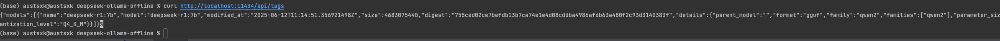

## ARM 版本
* 镜像
  > docker pull ollama/ollama:0.9.1-rc0
  > 

* 保存镜像
  ```shell
  docker pull --platform=linux/arm64 ollama/ollama:0.9.1-rc0
  docker inspect ollama/ollama:0.9.1-rc0 | grep Architecture
  # 应显示为 "Architecture": "arm64"
  docker save -o ollama-0.9.1-rc0-arm64.tar ollama/ollama:0.9.1-rc0
  ```

* 安装镜像
  ```shell
  docker load -i ollama-0.9.1-rc0-arm64.tar
  ```
  
* 启动
  > docker-compose up -d
  > 

* 验证
  > curl http://localhost:11434/api/tags
  