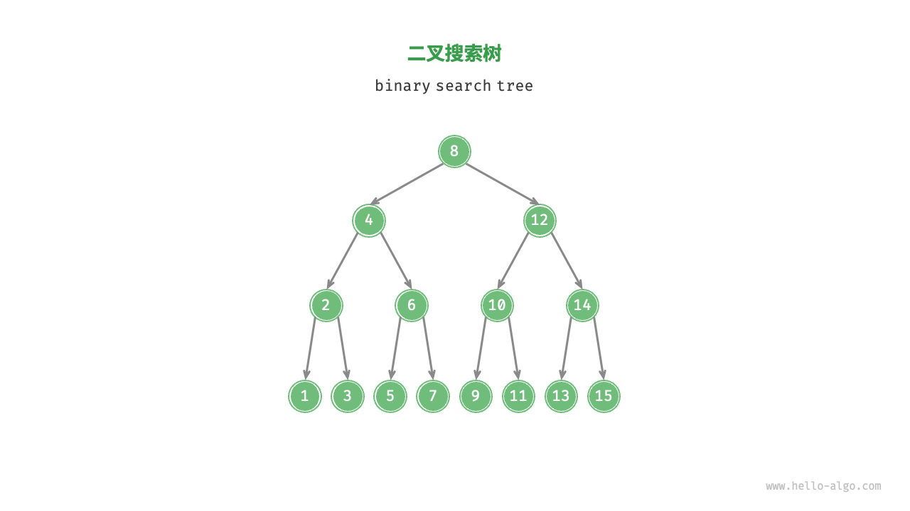

### 二叉搜索树
> 1. 左子树所有节点都小于根节点, 右子树所有节点都大于根节点
> 2. 左子树和右子树都是二叉搜索树
> 3. 没有键值相等的节点


### 代码实现
* go实现
```go
package tree

type TreeNode struct {
	Value int
	Left  *TreeNode
	Right *TreeNode
}

func NewTreeNode(value int) *TreeNode {
	return &TreeNode{
		Value: value,
		Left:  nil,
		Right: nil,
	}
}

import "fmt"

// BinarySearchTree 二叉搜索树
type BinarySearchTree struct {
	root *TreeNode
}

func NewBinarySearchTree() *BinarySearchTree {
	return &BinarySearchTree{root: nil}
}

func (bst *BinarySearchTree) Insert(value int) {
	currentNode := bst.root
	if bst.root == nil {
		bst.root = NewTreeNode(value)
		return
	}
	var prvNode *TreeNode = nil // 用来保存最后需要处理的节点
	for currentNode != nil {
		if currentNode.Value == value {
			// 插入的节点等于当前节点
			// 节点存在
			return
		}
		prvNode = currentNode
		if currentNode.Value > value {
			currentNode = currentNode.Left
		} else {
			currentNode = currentNode.Right
		}
	}
	// 循环结束 找到插入的节点 判断插入左侧还是右侧
	if prvNode.Value > value {
		prvNode.Left = NewTreeNode(value)
	} else {
		prvNode.Right = NewTreeNode(value)
	}
}

func (bst *BinarySearchTree) Search(value int) *TreeNode {
	if bst.root == nil {
		return nil
	}
	currentNode := bst.root
	for currentNode != nil {
		if currentNode.Value == value {
			return currentNode
		}
		if currentNode.Value > value {
			currentNode = currentNode.Left
		} else {
			currentNode = currentNode.Right
		}
	}
	return nil
}

func (bst *BinarySearchTree) Delete(value int) {
	// 保存当前节点的先驱节点
	var prvNode *TreeNode = nil
	var currentNode *TreeNode = bst.root
	if currentNode == nil {
		return
	}
	for currentNode != nil {
		if currentNode.Value == value {
			break
		}
		prvNode = currentNode
		if currentNode.Value > value {
			currentNode = currentNode.Left
		} else {
			currentNode = currentNode.Right
		}
	}
	// 判断是否差到需要删除的节点
	if currentNode == nil {
		// 无节点
		return
	}

	// 情况1: 删除的节点为叶子节点 节点度为0
	// 情况2: 删除的节点有一个子节点 节点度为1
	if currentNode.Left == nil || currentNode.Right == nil {
		var ch *TreeNode = nil
		if currentNode.Left != nil {
			ch = currentNode.Left
		} else {
			ch = currentNode.Right
		}
		// 删除当前节点
		if currentNode != bst.root {
			if prvNode.Left == currentNode {
				prvNode.Left = ch
			} else {
				prvNode.Right = ch
			}
		} else {
			currentNode = ch
		}
	} else {
		// 情况3: 删除的节点有2个子节点 节点度为2
		// 将当前删除的节点的值 替换为中序遍历的后继节点
		// 递归进行后继节点删除
		temp := currentNode.Right
		for temp.Left != nil {
			temp = temp.Left
		}

		// 此时找到当前删除节点的后继节点
		// 删除该节点
		bst.Delete(temp.Value)
		// 把当前节点删除节点的值修改
		currentNode.Value = temp.Value
	}
}

func (bst *BinarySearchTree) Print() {
	// 使用中序遍历输出
	bst.inorderDFS(bst.root)
}

func (bst *BinarySearchTree) inorderDFS(node *TreeNode) {
	if node == nil {
		return
	}
	// 先处理左子树
	bst.inorderDFS(node.Left)
	// 处理当前节点
	fmt.Printf("%d -> ", node.Value)
	// 处理右子树
	bst.inorderDFS(node.Right)
}
```


* C++实现
```cpp
// binary_search_tree.h
namespace BinarySearchTree {
    class BST {
    public:
        BST();
        ~BST();
        // 插入元素
        void Insert(int val);
        // 查询元素
        Tree::Tree* Search(int val);
        // 删除元素
        void Remove(int val);
        // 中序遍历元素
        void Print(void);
        void InorderTraversal(Tree::Tree*& root);

    private:
        Tree::Tree* root;
    };

    void testBinarySearchTree(void);
}

// binary_search_tree.cpp
namespace BinarySearchTree {
    // 构造
    BST::BST() {
        this->root = nullptr;
    }

    // 析构
    BST::~BST() {
        if (this->root != nullptr) {
            delete this->root;
            this->root = nullptr;
        }
    }

    // 插入元素
    void BST::Insert(int val) {
        // 若节点为空 创建根节点
        if (!this->root) {
            this->root = new Tree::Tree(val);
            return;
        }
        // 查询到需要插入节点的父节点
        Tree::Tree *prvNode = nullptr;
        Tree::Tree *current = this->root;
        while (current) {
            if (current->val == val) {
                cout << "插入的节点: " << val << " 已存在" << endl;
                return;
            }
            prvNode = current;
            // 如果value 大于当前节点的值 则插入右侧 反之插入左侧
            if (val > current->val) {
                current = current->right;
            } else {
                current = current->left;
            }
        }

        // 此时需要插入节点
        if (val > prvNode->val) {
            prvNode->right = new Tree::Tree(val);
        } else {
            prvNode->left = new Tree::Tree(val);
        }
        cout << "节点：" << val << "插入成功！" << endl;
    }

    // 查询元素
    Tree::Tree *BST::Search(int val) {
        if (this->root == nullptr) {
            return nullptr;
        }
        Tree::Tree *currentNode = this->root;
        while (currentNode) {
            if (currentNode->val == val) {
                break;
            }
            if (val > currentNode->val) {
                currentNode = currentNode->right;
            } else {
                currentNode = currentNode->left;
            }

        }
        if (currentNode) {
            return currentNode;
        }
        return nullptr;
    }

    // 删除元素
    void BST::Remove(int val) {
        // 删除元素区分3种情况
        // 0和1 2个度
        // 1. 先找到需要删除的节点
        if (!this->root) {
            return;
        }
        // 查询到需要插入节点的父节点
        Tree::Tree *prvNode = nullptr;
        Tree::Tree *current = this->root;
        while (current) {
            if (current->val == val) {
                break;
            }
            prvNode = current;
            // 如果value 大于当前节点的值 则插入右侧 反之插入左侧
            if (val > current->val) {
                current = current->right;
            } else {
                current = current->left;
            }
        }

        // 无元素
        if (!current) {
            cout << "未找到到需要删除的元素: " << val << endl;
            return;
        }

        // 如果删除的元素为叶子节点 或者删除的元素只有一个子节点
        if (current->left == nullptr || current->right == nullptr) {
            Tree::Tree *child = nullptr;
            if (current->right) {
                // 左节点存在
                child = current->right;
            } else {
                // 右节点存在 或者 都不存在 当前节点为叶子节点
                child = current->left;
            }

            // 判断是否为根
            if (current != this->root) {
                if (current == prvNode->left) {
                    // 若删除的节点为父亲节点的左节点
                    prvNode->left = child;
                } else {
                    prvNode->right = child;
                }
            } else {
                // 如果当前处理的节点为根
                this->root = child;
            }
        } else {
            // 删除的节点有左、右子树
            // 先获取到当前删除节点 中序遍历的后继节点 然后使该节点变为当前删除的节点
            Tree::Tree *temp = current->right;
            while (temp->left) {
                temp = temp->left;
            }
            // 此时以及找到当前删除节点的后继节点
            // 删除该节点
            this->Remove(temp->val);
            // 同时 将删除节点的值 替换为后继节点的值 从而完成树的调整
            current->val = temp->val;
        }

    }

    // 输出元素
    void BST::Print(void) {
        this->InorderTraversal(this->root);
    }

    // 中序号遍历
    void BST::InorderTraversal(Tree::Tree *&root) {
        if (!root) {
            return;
        }
        // 左
        this->InorderTraversal(root->left);
        // 中
        cout << root->val << "->";
        // 右
        this->InorderTraversal(root->right);
    }

    // 测试二叉搜索树
    void testBinarySearchTree(void)
    {
        cout << "二叉搜索树测试: " << endl;
        class BST bst = BST();
        bst.Insert(10);
        bst.Insert(5);
        bst.Insert(3);
        bst.Insert(7);
        bst.Insert(15);
        bst.Insert(12);
        bst.Insert(18);

        cout << "打印二叉搜索树: " << endl;
        bst.Print();
        cout << endl;

        // 查询元素
        auto node = bst.Search(5);
        if (node)
        {
            cout << "元素5搜索到!" << endl;
        }

        auto node1 = bst.Search(99999);
        if (node1)
        {
            cout << "元素99999搜索到!" << endl;
        } else {
            cout << "元素99999未搜索到!" << endl;
        }

        // 删除叶子节点
        bst.Remove(3);
        cout << "删除3后的输出: " << endl;
        bst.Print();
        cout << endl;

        // 插入3 6
        bst.Insert(3);
        bst.Insert(6);
        cout << "删除元素7后: " << endl;
        bst.Remove(7);
        bst.Print();
        cout << endl;

        // 插入7 搜索2个节点的5
        cout << "删除元素5，度为2的节点: " << endl;
        bst.Insert(7);
        bst.Remove(5);
        bst.Print();
        cout << endl;
    }
}
```