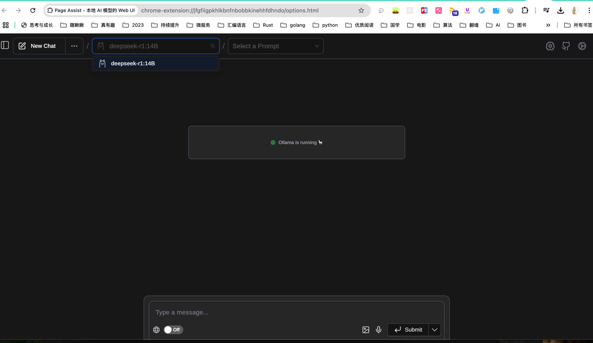
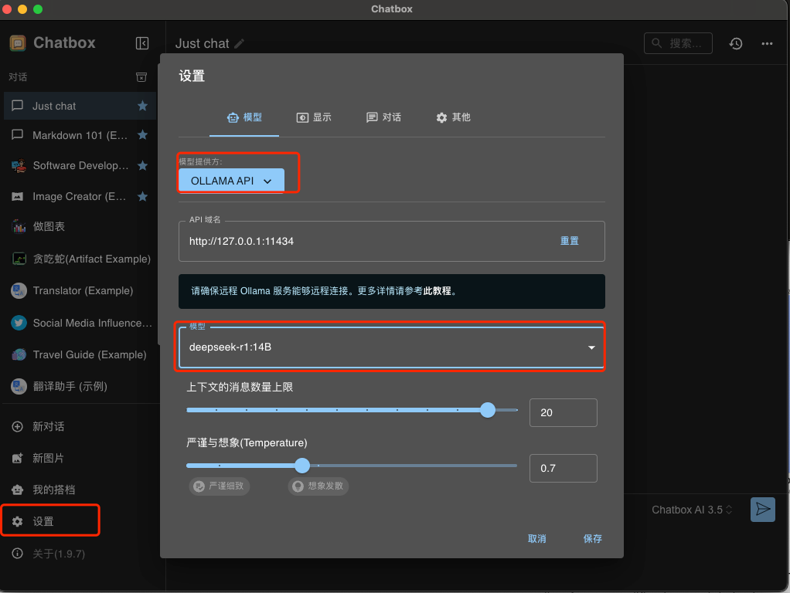
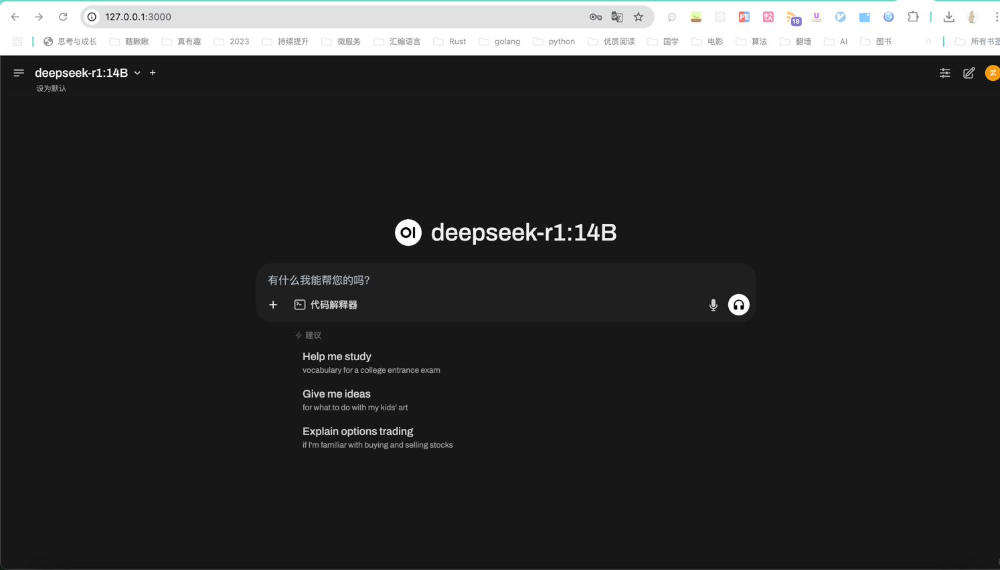

### DeepSeek本地部署
#### 1. 下载
[ollama下载地址](https://ollama.com/download/mac) 
解压后, 将ollama拖到应用程序即可

#### 2. 下载模型
[模型下载匹配](https://ollama.com/library/deepseek-r1)
```shell
ollama run deepseek-r1:14B
```

#### 3.可视化插件  
* Page Assist(chrome浏览器插件)  
  如下图所示:  
    
* Chatbox  
  * [下载地址](https://chatboxai.app/zh#download)
  * 设置:  
    
* Docker部署
  * 运行部署OpenWebUI,[仓库地址](https://github.com/open-webui/open-webui)(docker安装不在赘述)
    > docker run -d -p 3000:8080 --add-host=host.docker.internal:host-gateway -v open-webui:/app/backend/data --name open-webui --restart always ghcr.io/open-webui/open-webui:main
  * 访问: http://127.0.0.1:3000/
  结果如下:  
  