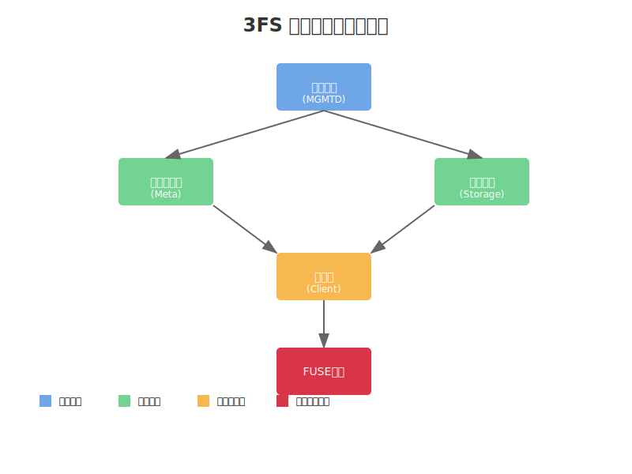
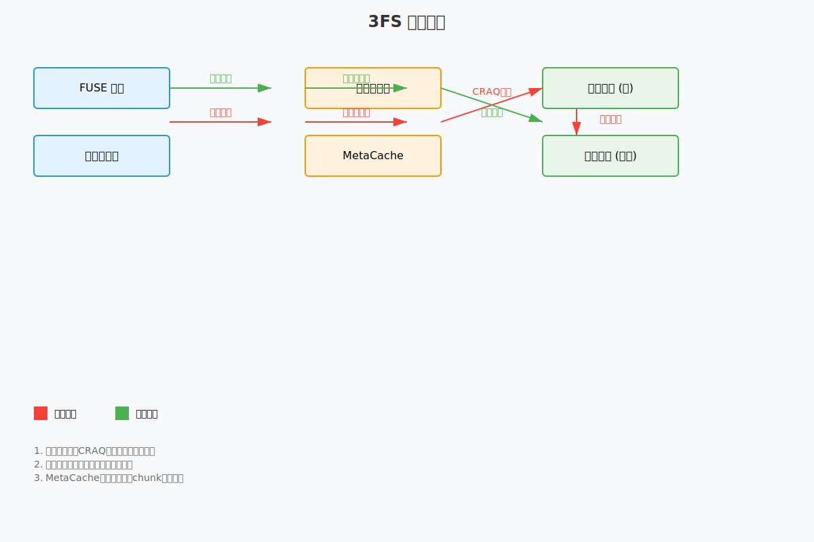

# 3FS：为AI优化的高性能分布式文件系统
3FS是由DeepSeek开发的一种专为AI工作负载设计的分布式文件系统。它结合了最新的存储技术和网络传输技术，以满足现代AI应用对数据处理和存储的高性能需求。

## 项目概述
### 系统架构
* 采用分离式架构，结合了数千个SSD和数百个存储节点的网络带宽
* 实现了CRAQ (Chain Replication with Apportioned Queries) 以保证强一致性
* 基于事务性键值存储(FoundationDB)的无状态元数据服务  

### 核心组件
* mgmtd：管理节点，负责集群管理和配置
* meta：元数据服务，管理文件系统的元数据
* storage：存储服务，负责数据存储和访问
* client：客户端库，提供API接口
* fuse：文件系统接口，提供POSIX兼容的文件系统访问

### 主要功能
- 数据准备：高效组织和管理数据分析管道的输出
- 数据加载：支持训练样本的随机访问
- 检查点：支持大规模训练的高吞吐并行检查点
- KVCache：为推理提供基于SSD的高效缓存方案
### 技术栈
- 主要使用C++开发
- 使用CMake构建系统
- 集成多个高性能组件：RocksDB、Folly、RDMA等
- 完整的测试框架和监控系统

### 主要特点
- 高吞吐量和低延迟 
  > 3FS在180个节点的集群上实现了高达6.6 TiB/s的读取吞吐量，这一性能指标突显了其在处理大规模数据操作时的能力。

- 分布式架构
  > 该文件系统通过聚合数千个SSD的带宽，优化数据存储和检索，减少了数据局限性带来的延迟，增强了系统的可伸缩性和灵活性。

- 强一致性保证
  > 3FS采用链式复制与分配查询（CRAQ）模型来保证数据的强一致性，这对于需要实时、一致性访问数据的AI训练和推断工作流至关重要。

- 元数据的无状态管理
  > 利用FoundationDB等事务性键值存储系统来管理元数据，从而提高元数据检索的速度和系统的可扩展性。

- AI推断优化
  > 3FS引入了KVCache技术，为AI推断过程中的数据访问提供了高速缓存层，这有助于提高实时数据访问的效率并减少延迟。

## 数据写入和读取的流程
1. 客户端通过FUSE接口接收文件系统请求。FUSE进程负责处理文件系统操作，并通过USRBIO（User Space Ring Based IO）提供高速I/O功能。
   用户应用可以直接向FUSE进程的I/O队列提交请求，绕过FUSE本身的一些限制。
2. 客户端组件包含两个主要部分：
    - 元数据客户端：负责与元数据服务交互，获取文件的位置信息和属性
    - 存储客户端：负责与存储服务进行数据读写
3. 存储服务采用CRAQ（Chain Replication with Apportioned Queries）协议实现强一致性：
    - 写入采用write-all-read-any方式，充分利用SSD和RDMA网络的吞吐量
    - 文件被分割成等大小的块，并在多个SSD上进行复制
    - 读取可以从任意副本读取数据，提高读取性能
4. 管理节点负责：
    - 处理元数据和存储服务的心跳
    - 维护集群成员关系变更
    - 分发集群配置到其他服务和客户端
    - 在节点故障时进行故障转移

数据流图:  
  

说明:  
CRAQ (Chain Replication with Apportioned Queries) 是3FS中使用的一种数据复制协议。它通过链式复制的方式来保证数据的强一致性，
同时优化了读取性能。在CRAQ中，写操作必须经过整个复制链，而读操作可以从任意副本读取。具体来说，当写入数据时，请求从链的头节点开始，依次复制到所有节点，
直到尾节点确认；读取时，如果节点发现自己持有最新版本的数据，可以直接返回，否则需要询问链上的其他节点。这种设计在保证一致性的同时，
通过允许从任意节点读取来提高了系统的整体性能。

### 应用场景
3FS专为满足现代AI应用的需求而设计，适用于需要大规模数据集训练和高速数据访问的AI模型训练和推断等场景。它的高性能和可扩展性特性使其成为处理复杂数据工作负载的理想选择。

### 开源和社区贡献
3FS是一个开源项目，这意味着开发者和研究人员可以自由地查看、修改和贡献代码。这种开放性促进了技术的透明度和社区的合作，使得3FS能够不断地根据用户的反馈和技术发展进行优化和改进。

## 结论
3FS作为一个为AI数据管理设计的高性能分布式文件系统，在提升AI训练和推断效率方面展现出了巨大的潜力。随着AI技术的不断进步，对高效、可扩展的数据管理解决方案的需求将持续增长，而3FS则为满足这些需求提供了一个强有力的工具。对于希望提升其AI基础设施性能的组织和研究人员来说，了解并使用3FS将是一个明智的选择。

[部署文档](https://github.com/deepseek-ai/3FS/blob/main/deploy/README.md)  
[官方文档](https://github.com/deepseek-ai/3FS)    