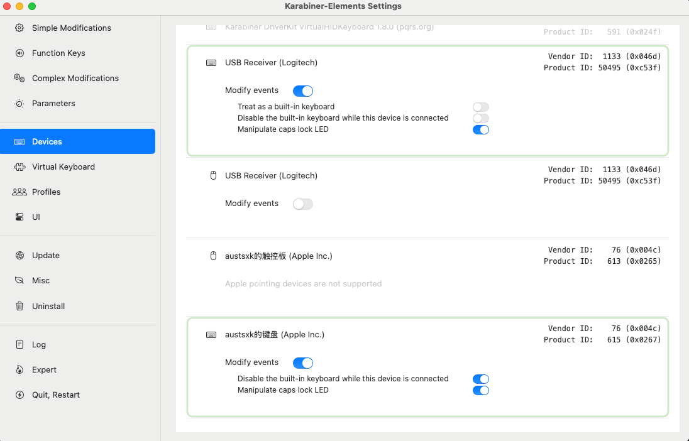

### 将macbook 内置键盘锁定,只使用外置键盘的方法

#### 背景
> 有时候想把键盘或者Pad或者电子阅读器放在键盘上,如果不锁定键盘,容易产生误触
>

#### 工具-**Karabiner**介绍
  Karabiner-Elements 是一款适用于 macOS 的 键盘自定义工具，它提供了强大的按键映射、快捷键配置和高级键盘操作功能，特别适合程序员、写作者、游戏玩家和需要特定键盘布局的用户。  
*主要功能*:
* 键位重映射 
  - 允许你将键盘上的某个键重新映射为另一个键，比如把 Caps Lock 变成 Esc 或者 Cmd
  - 适用于修正键盘布局（如 Windows 键盘在 Mac 上的适配）
* 复杂修改 (Complex Modifications)
  - 通过 JSON 配置文件，创建自定义按键组合，如 Ctrl + Space 触发某个特定功能
  - 可以下载社区提供的现成规则，如 Vim 风格键映射等
* 多设备支持  
* 层级操作 (Hyper Key)  
* 按键触发 Shell 脚本 等

#### 安装与使用  
[Karabiner下载地址](https://github.com/pqrs-org/Karabiner-Elements/releases)  
[官方文档](https://karabiner-elements.pqrs.org/docs/manual/configuration/configure-devices/)

安装官方文档进行授权后,我只使用了禁用内置键盘功能截图如下:  

