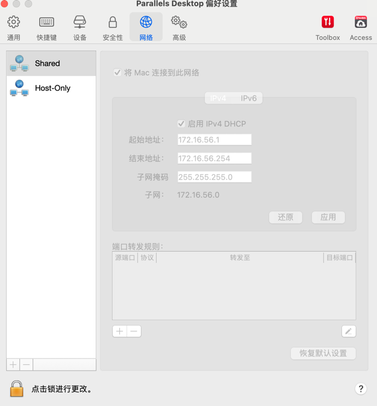

### 网段类别

- 宿主机网段
  > 宿主机网段是K8S集群中每个物理节点的IP地址所在的网段，这个网段通常是网络管理员分配或者云厂商分配。 
- Service网段
  >
  K8S集群内部的服务发现和负载均衡使用的IP网段。这个IP是虚拟的，是K8S分配给创建的Service的虚拟IP，这个IP不能和宿主机网段以及Pod网段重叠。 
  > 是代理Pod进行流量转发的ip，是kubernetes Service对象IP地址。 
- Pod网段
  > K8S集群分配给每个Pod，Pod网段用于容器间通讯以及容器与K8s组件通讯。 

### 网段计算

工具: http://tools.jb51.net/aideddesign/ip_net_calc/

### 配置虚拟机主机网段

### 实验室集群搭建网段定义

| 名称        | 网段             |
|-----------|----------------|
| 主机节点网段    | 172.16.56.1/24 |
| Service网段 | 10.96.0.0/12   |
| Pod网段     | 192.168.0.0/12 |

### 服务器节点IP配置定义表

| 节点名称         | IP            |
|--------------|---------------|
| K8s-master01 | 172.16.56.201 |
| K8s-master02 | 172.16.56.202 |
| K8s-master03 | 172.16.56.203 |
| K8s-node01   | 172.16.56.204 |
| K8s-node02   | 172.16.56.205 |

### 安装版本确定
K8s: 1.28
System: Arm Ubuntu22.04 Jammy

### 参考来源  
[宽哥视频](https://edu.51cto.com/course/23845.html) https://edu.51cto.com/course/23845.html

