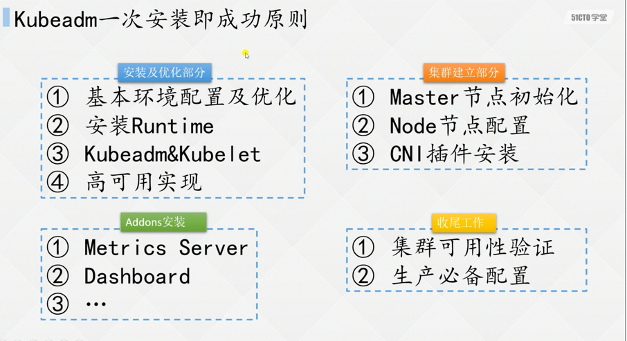
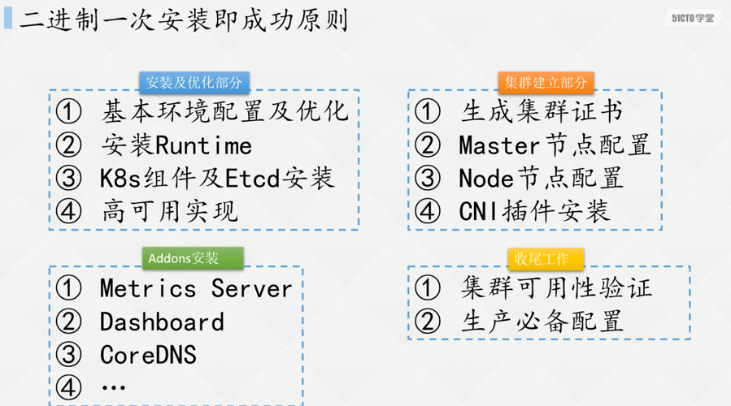

### kubeadm安装的主要部分

* 安装与优化
  * 基本安装与优化(主机名、swap、seLinux、ipvs等)
  * 运行时(docker<小于1.24>、containerd<大于1.24>)
  * 安装kubeadm、kubelet
  * 高可用实现(keepalived、keepalived+nginx)
* 集群建立  
  * master节点初始化
  * node节点配置与join
  * 网络插件解决节点间通讯问题(calico、flannel)
* 插件安装
  * metric server(指标)
  * Dashboard(控制面板)
* 集群验证
  * 集群的可用性验证
  * 生产环境的必要配置

### 二进制安装

* 安装与优化
  * 服务器基本安装与优化(主机名、swap、seLinux、ipvs等)
  * 运行时安装
  * 安装K8s组件与Etcd
  * 高可用安装
* 集群建立
  * 集群证书生成(重点、这里网段容易冲突要注意)
  * master节点初始化
  * node节点配置
  * CNI网络插件安装
* 插件安装
  * metric server
  * dashboard 安装
  * CoreDNS安装
* 集群验证
  * 集群可用性验证
  * 生产环境的必要配置

模块基本上和kubeadm类似,主要注意的是证书生成,部分差距。

### 注意
1. 版本选择: 建议第三个版本号大于5(1.23.6)
2. 安装环境: 学习环境可以使用虚拟机
3. IP地址: 需要使用固定IP,不能使用静态IP地址
4. 安装文档IP地址规划: 不要一个一个替换，使用统一替换
  - 5个IP地址
  - 1个VIP
  - 替换Pod网段
  - 替换service网段
  - service网段会涉及2个ip地址 (计算第一个service的ip地址 进行替换 CoreDNS 第10个IP地址)

5. 安装技巧(先看一遍视频，以文档为主)

### 参考来源
[宽哥视频](https://edu.51cto.com/course/23845.html) https://edu.51cto.com/course/23845.html