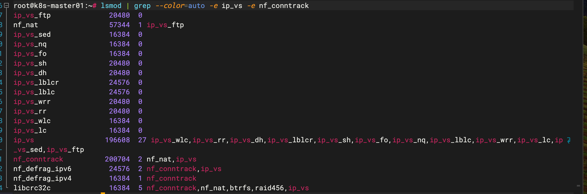

## 基本环境设置
### 1. 设置五台机器的主机名称
```shell
# 172.16.56.201 k8s-master01
hostnamectl hostname k8s-master01

# 172.16.56.202 k8s-master02
hostnamectl hostname k8s-master02

# 172.16.56.203 k8s-master03
hostnamectl hostname k8s-master03

# 172.16.56.204 k8s-node01
hostnamectl hostname k8s-node01

# 172.16.56.205 k8s-node02
hostnamectl hostname k8s-node02
```

### 2. 所有节点修改/etc/hosts
```shell
vim /etc/hosts
# 将下面内容追加到文件末尾
172.16.56.201 k8s-master01
172.16.56.202 k8s-master02
172.16.56.203 k8s-master03
172.16.56.236 k8s-master-lb # 如果不是高可用集群，该IP为Master01的IP
172.16.56.204 k8s-node01
172.16.56.205 k8s-node02
```

### 3. 所有节点换源
```shell
cp /etc/apt/sources.list /etc/apt/sources.list.bak.2

# 更新为阿里云源
# 源网址: https://mirror.tuna.tsinghua.edu.cn/help/ubuntu/
sudo bash -c "cat << EOF > /etc/apt/sources.list && apt update && apt upgrade -y
# 默认注释了源码镜像以提高 apt update 速度，如有需要可自行取消注释
deb https://mirrors.tuna.tsinghua.edu.cn/ubuntu-ports/ jammy main restricted universe multiverse
# deb-src https://mirrors.tuna.tsinghua.edu.cn/ubuntu-ports/ jammy main restricted universe multiverse
deb https://mirrors.tuna.tsinghua.edu.cn/ubuntu-ports/ jammy-updates main restricted universe multiverse
# deb-src https://mirrors.tuna.tsinghua.edu.cn/ubuntu-ports/ jammy-updates main restricted universe multiverse
deb https://mirrors.tuna.tsinghua.edu.cn/ubuntu-ports/ jammy-backports main restricted universe multiverse
# deb-src https://mirrors.tuna.tsinghua.edu.cn/ubuntu-ports/ jammy-backports main restricted universe multiverse
deb https://mirrors.tuna.tsinghua.edu.cn/ubuntu-ports/ jammy-security main restricted universe multiverse
# deb-src https://mirrors.tuna.tsinghua.edu.cn/ubuntu-ports/ jammy-security main restricted universe multiverse
# 预发布软件源，不建议启用
# deb https://mirrors.tuna.tsinghua.edu.cn/ubuntu-ports/ jammy-proposed main restricted universe multiverse
# deb-src https://mirrors.tuna.tsinghua.edu.cn/ubuntu-ports/ jammy-proposed main restricted universe multiverse
EOF"

# 安装基本工具
apt install lvm2 -y

# 增加k8s的源
# 下载 Google Cloud 公开签名秘钥（阿里云镜像）：
curl -fsSL https://mirrors.aliyun.com/kubernetes/apt/doc/apt-key.gpg | sudo gpg --dearmor -o /etc/apt/keyrings/kubernetes-archive-keyring.gpg
# 添加 Kubernetes apt 仓库（阿里云镜像）：
echo "deb [signed-by=/etc/apt/keyrings/kubernetes-archive-keyring.gpg] https://mirrors.aliyun.com/kubernetes/apt/ kubernetes-xenial main" | sudo tee /etc/apt/sources.list.d/kubernetes.list

apt update -y
```

### 4. 所有节点安装必备工具
```shell
apt install -y wget jq vim net-tools telnet git selinux-utils selinux-policy-default
```

### 5. 所有节点关闭防火墙、selinux、dnsmasq、swap
```shell
# 关闭防火墙
systemctl disable --now firewalld 
systemctl disable --now dnsmasq
# systemctl disable --now NetworkManager

# 关闭SeLinux
setenforce 0
sed -i 's#SELINUX=permissive#SELINUX=disabled#g' /etc/selinux/config

# 关闭swap分区(为了提高k8s性能、k8s没办法限制swap内存限制)
swapoff -a && sysctl -w vm.swappiness=0
# 关闭开机自启动swap
cp /etc/fstab{,.bak2}
sed -ri '/^[^#]*swap/s@^@#@' /etc/fstab
```

### 6. 所有节点安装时间同步工具
```shell
apt install ntpdate -y
# 所有节点同步时间。时间同步配置如下
ln -sf /usr/share/zoneinfo/Asia/Shanghai /etc/localtime
echo 'Asia/Shanghai' >/etc/timezone
ntpdate time2.aliyun.com
# 添加至crontab 定时任务 crontab -e , 将下面内容写入
*/5 * * * * /usr/sbin/ntpdate time2.aliyun.com
```

### 7. 所有节点配置文件描述符(所有节点配置limit)
```shell
ulimit -SHn 65535
# 开机生效
vim /etc/security/limits.conf
# 末尾添加如下内容
* soft nofile 65536
* hard nofile 131072
* soft nproc 65535
* hard nproc 655350
* soft memlock unlimited
* hard memlock unlimited
```

### 8. 所有节点系统内核版本查询
```shell
uname -a
```

### 9. master01节点免密码登录其他节点
```shell
# 生成公钥 直接回车
ssh-keygen -t rsa

for i in k8s-master01 k8s-master02 k8s-master03 k8s-node01 k8s-node02;do ssh-copy-id -i .ssh/id_rsa.pub $i;done
```

### 10. master01节点下下载源码文件
```shell
cd ~
git clone https://gitee.com/dukuan/k8s-ha-install.git
```

## 内核升级
### 11. 所有节点升级系统内核, ubuntu22.04内核版本为5.15 不用升级
```shell
uname -a 
# Linux k8s-master01 5.15.0-94-generic #104-Ubuntu SMP Tue Jan 9 15:26:57 UTC 2024 aarch64 aarch64 aarch64 GNU/Linux
```

### 12. 所有节点安装ipvsadm (ip负载均衡工具)
```shell
apt install ipvsadm ipset sysstat conntrack -y
# libseccomp不存在
# apt install libseccomp -y

# 所有节点配置ipvsadm模块
sudo modprobe ip_vs
sudo modprobe ip_vs_rr
sudo modprobe ip_vs_wrr
sudo modprobe ip_vs_sh
sudo modprobe nf_conntrack

# 所有节点 开机自动加载内核模块
cat <<EOF > /etc/modules-load.d/ipvs.conf
ip_vs
ip_vs_lc
ip_vs_wlc
ip_vs_rr
ip_vs_wrr
ip_vs_lblc
ip_vs_lblcr
ip_vs_dh
ip_vs_sh
ip_vs_fo
ip_vs_nq
ip_vs_sed
ip_vs_ftp
ip_vs_sh
nf_conntrack
ip_tables
ip_set
xt_set
ipt_set
ipt_rpfilter
ipt_REJECT
ipip
EOF
```

### 13. 所有节点设置k8s内核参数设置
```shell
cat <<EOF > /etc/sysctl.d/k8s.conf
net.ipv4.ip_forward = 1
net.bridge.bridge-nf-call-iptables = 1
net.bridge.bridge-nf-call-ip6tables = 1
fs.may_detach_mounts = 1
net.ipv4.conf.all.route_localnet = 1
vm.overcommit_memory=1
vm.panic_on_oom=0
fs.inotify.max_user_watches=89100
fs.file-max=52706963
fs.nr_open=52706963
net.netfilter.nf_conntrack_max=2310720

net.ipv4.tcp_keepalive_time = 600
net.ipv4.tcp_keepalive_probes = 3
net.ipv4.tcp_keepalive_intvl =15
net.ipv4.tcp_max_tw_buckets = 36000
net.ipv4.tcp_tw_reuse = 1
net.ipv4.tcp_max_orphans = 327680
net.ipv4.tcp_orphan_retries = 3
net.ipv4.tcp_syncookies = 1
net.ipv4.tcp_max_syn_backlog = 16384
net.ipv4.ip_conntrack_max = 65536
net.ipv4.tcp_max_syn_backlog = 16384
net.ipv4.tcp_timestamps = 0
net.core.somaxconn = 16384
EOF

sysctl --system
# 重启系统
# 验证ipvs模块是否加载成功
lsmod | grep --color=auto -e ip_vs -e nf_conntrack
# 如下图即可
```


## 高可用组件安装
### 14. 所有master节点安装haproxy和keepalived 
```shell
# 安装haproxy和keepalived
apt install keepalived haproxy -y

# haproxy 配置
mkdir /etc/haproxy
# 修改配置 vim /etc/haproxy/haproxy.cfg 内容如下
global
  maxconn  2000
  ulimit-n  16384
  log  127.0.0.1 local0 err
  stats timeout 30s

defaults
  log global
  mode  http
  option  httplog
  timeout connect 5000
  timeout client  50000
  timeout server  50000
  timeout http-request 15s
  timeout http-keep-alive 15s

frontend monitor-in
  bind *:33305
  mode http
  option httplog
  monitor-uri /monitor

frontend k8s-master
  bind 0.0.0.0:16443
  bind 127.0.0.1:16443
  mode tcp
  option tcplog
  tcp-request inspect-delay 5s
  default_backend k8s-master

backend k8s-master
  mode tcp
  option tcplog
  option tcp-check
  balance roundrobin
  default-server inter 10s downinter 5s rise 2 fall 2 slowstart 60s maxconn 250 maxqueue 256 weight 100
  server k8s-master01	172.16.56.201:6443  check
  server k8s-master02	172.16.56.202:6443  check
  server k8s-master03	172.16.56.203:6443  check

# 注意配置 ip 网卡名称 VIP地址 一定要一个一个配置
# k8s-master01
ifconfig 
# 获取网卡名称为 enp0s5
mkdir /etc/keepalived
vim /etc/keepalived/keepalived.conf
# 写入内容如下:
! Configuration File for keepalived
global_defs {
    router_id LVS_DEVEL
script_user root
    enable_script_security
}
vrrp_script chk_apiserver {
    script "/etc/keepalived/check_apiserver.sh"
    interval 5
    weight -5
    fall 2  
rise 1
}
vrrp_instance VI_1 {
    state MASTER
    interface enp0s5
    mcast_src_ip 172.16.56.201
    virtual_router_id 51
    priority 101
    advert_int 2
    authentication {
        auth_type PASS
        auth_pass K8SHA_KA_AUTH
    }
    virtual_ipaddress {
        172.16.56.236
    }
    track_script {
       chk_apiserver
    }
}

# k8s-master02 172.16.56.202 enp0s5
ifconfig 
# 获取网卡名称为 enp0s5
mkdir /etc/keepalived
vim /etc/keepalived/keepalived.conf
# 写入内容如下:
! Configuration File for keepalived
global_defs {
    router_id LVS_DEVEL
script_user root
    enable_script_security
}
vrrp_script chk_apiserver {
    script "/etc/keepalived/check_apiserver.sh"
   interval 5
    weight -5
    fall 2  
rise 1
}
vrrp_instance VI_1 {
    state BACKUP
    interface enp0s5
    mcast_src_ip 172.16.56.202
    virtual_router_id 51
    priority 100
    advert_int 2
    authentication {
        auth_type PASS
        auth_pass K8SHA_KA_AUTH
    }
    virtual_ipaddress {
        172.16.56.236
    }
    track_script {
       chk_apiserver
    }
}

# k8s-master03 172.16.56.203 enp0s5
mkdir /etc/keepalived
vim /etc/keepalived/keepalived.conf
# 写入内容如下:
! Configuration File for keepalived
global_defs {
    router_id LVS_DEVEL
script_user root
    enable_script_security
}
vrrp_script chk_apiserver {
    script "/etc/keepalived/check_apiserver.sh"
 interval 5
    weight -5
    fall 2  
rise 1
}
vrrp_instance VI_1 {
    state BACKUP
    interface enp0s5
    mcast_src_ip 172.16.56.203
    virtual_router_id 51
    priority 100
    advert_int 2
    authentication {
        auth_type PASS
        auth_pass K8SHA_KA_AUTH
    }
    virtual_ipaddress {
        172.16.56.236
    }
    track_script {
       chk_apiserver
    }
}

# 所有master节点配置KeepAlived健康检查文件
cat << EOF > /etc/keepalived/check_apiserver.sh
#!/bin/bash

err=0
for k in $(seq 1 3)
do
    check_code=$(pgrep haproxy)
    if [[ $check_code == "" ]]; then
        err=$(expr $err + 1)
        sleep 1
        continue
    else
        err=0
        break
    fi
done

if [[ $err != "0" ]]; then
    echo "systemctl stop keepalived"
    /usr/bin/systemctl stop keepalived
    exit 1
else
    exit 0
fi
EOF

chmod +x /etc/keepalived/check_apiserver.sh

# 所有master节点启动haproxy和keepalived
systemctl daemon-reload
systemctl enable --now haproxy
systemctl enable --now keepalived

# 所有节点测试vip是否通畅
ping 172.16.56.236 -c 4
telnet 172.16.56.236 16443
# 出现下面内容即可
root@k8s-master03:~# telnet 172.16.56.236 16443
Trying 172.16.56.236...
Connected to 172.16.56.236.
Escape character is '^]'.
Connection closed by foreign host.
```

## K8s组件安装与运行时
### 15. 所有节点安装containerd
```shell
apt install docker.io docker-compose 
# 查看版本
docker --version
# Docker version 24.0.5, build 24.0.5-0ubuntu1~22.04.1
# docker安装会自动安装containerd 我们需要练习docker操作 所以安装docker即可  不启动docker

# 配置 containerd 所需要的模块
cat <<EOF | sudo tee /etc/modules-load.d/containerd.conf
overlay
br_netfilter
EOF

# 所有节点加载模块 
sudo modprobe overlay
sudo modprobe br_netfilter

# 所有节点，配置Containerd所需的内核
cat <<EOF | sudo tee /etc/sysctl.d/99-kubernetes-cri.conf
net.bridge.bridge-nf-call-iptables  = 1
net.ipv4.ip_forward                 = 1
net.bridge.bridge-nf-call-ip6tables = 1
EOF

# 所有节点 加载内核
sysctl --system

# 所有节点配置Containerd的配置文件
mkdir -p /etc/containerd
containerd config default | tee /etc/containerd/config.toml
# 所有节点将Containerd的Cgroup改为Systemd, 找到containerd.runtimes.runc.options，添加或修改SystemdCgroup = true（如果已存在直接修改，否则会报错）
# 所有节点将sandbox_image的Pause镜像改成符合自己版本的地址registry.cn-hangzhou.aliyuncs.com/google_containers/pause:3.6：
vim /etc/containerd/config.toml

# 所有节点启动Containerd，并配置开机自启动
systemctl daemon-reload
systemctl enable --now containerd

# 所有节点配置crictl客户端连接的运行时位置
cat > /etc/crictl.yaml <<EOF
runtime-endpoint: unix:///run/containerd/containerd.sock
image-endpoint: unix:///run/containerd/containerd.sock
timeout: 10
debug: false
EOF
```

### 16. 安装k8s组件
```shell
# 在k8s-master01 查询当前kubeadm版本
apt list -a kubeadm | grep kubeadm

# 所有节点安装1.28最新版本kubeadm、kubelet和kubectl
apt install -y kubeadm=1.28.* kubelet=1.28.* kubectl=1.28.*

# 所有节点设置Kubelet开机自启动
systemctl daemon-reload
systemctl enable --now kubelet
```

### 17. 集群初始化
```shell
# 只在k8s-master01节点上操作
vim kubeadm-config.yaml
# 写入下面的内容 注意 kubeadm版本号要保持一直
apiVersion: kubeadm.k8s.io/v1beta3
bootstrapTokens:
- groups:
  - system:bootstrappers:kubeadm:default-node-token
  token: 7t2weq.bjbawausm0jaxury
  ttl: 24h0m0s
  usages:
  - signing
  - authentication
kind: InitConfiguration
localAPIEndpoint:
  advertiseAddress: 172.16.56.201
  bindPort: 6443
nodeRegistration:
  criSocket: unix:///var/run/containerd/containerd.sock
  name: k8s-master01
  taints:
  - effect: NoSchedule
    key: node-role.kubernetes.io/control-plane
---
apiServer:
  certSANs:
  - 172.16.56.236
  timeoutForControlPlane: 4m0s
apiVersion: kubeadm.k8s.io/v1beta3
certificatesDir: /etc/kubernetes/pki
clusterName: kubernetes
controlPlaneEndpoint: 172.16.56.236:16443
controllerManager: {}
etcd:
  local:
    dataDir: /var/lib/etcd
imageRepository: registry.cn-hangzhou.aliyuncs.com/google_containers
kind: ClusterConfiguration
kubernetesVersion: v1.28.0 # 更改此处的版本号和kubeadm version一致
networking:
  dnsDomain: cluster.local
  podSubnet: 192.168.0.0/16
  serviceSubnet: 10.96.0.0/16
scheduler: {}

# 更新kubeadm文件
kubeadm config migrate --old-config kubeadm-config.yaml --new-config new.yaml

# 将new.yaml文件复制到其他master节点
for i in k8s-master02 k8s-master03; do scp new.yaml $i:/root/; done

# 所有master节点下载镜像
kubeadm config images pull --config /root/new.yaml

# root@k8s-master03:~# kubeadm config images pull --config /root/new.yaml
# [config/images] Pulled registry.cn-hangzhou.aliyuncs.com/google_containers/kube-apiserver:v1.28.0
# [config/images] Pulled registry.cn-hangzhou.aliyuncs.com/google_containers/kube-controller-manager:v1.28.0
# [config/images] Pulled registry.cn-hangzhou.aliyuncs.com/google_containers/kube-scheduler:v1.28.0
# [config/images] Pulled registry.cn-hangzhou.aliyuncs.com/google_containers/kube-proxy:v1.28.0
# [config/images] Pulled registry.cn-hangzhou.aliyuncs.com/google_containers/pause:3.9
# [config/images] Pulled registry.cn-hangzhou.aliyuncs.com/google_containers/etcd:3.5.9-0
# [config/images] Pulled registry.cn-hangzhou.aliyuncs.com/google_containers/coredns:v1.10.1

# k8s-master01节点初始化
kubeadm init --config /root/new.yaml  --upload-certs

# 初始化后的信息见k8s-master01.init

# k8s-master01 节点配置环境变量，用于访问Kubernetes集群
cat <<EOF >> /root/.bashrc
export KUBECONFIG=/etc/kubernetes/admin.conf
EOF
source /root/.bashrc

# 在 k8s-master01 节点查看节点状态
kubectl get nodes 

# 在 k8s-master01 节点查看kube-system命令空间下的pod
kubectl get po -n kube-system
```

### 18. 高可用master配置
```shell
# 其他master加入集群，master02和master03分别执行 初始化集群时生成的命令
kubeadm join 172.16.56.236:16443 --token 7t2weq.bjbawausm0jaxury \
        --discovery-token-ca-cert-hash sha256:5d21ef804d32c51c3448cebd0bd7a8f6205b36631de2576bf4a489ddede41d09 \
        --control-plane --certificate-key 41ae6de8c9851b8eb21f439c8160bd5ea85bf9d4675c0e3d10c4a0809b506c31
```

### 19. token过期处理(没过期不用处理)
```shell
# token过期后生成新的token
# 如果是node节点需要使用 则在k8s-master01上生成 将会得到一个node节点加入的命令 和下面20差不多
kubeadm token create --print-join-command

# master需要生成--certificate-key
# 如果master节点加入 则需要生成key 然后在node加入的命令后继续加入 --control-plane --certificate-key 生成的内容即可
kubeadm init phase upload-certs  --upload-certs
```

### 20. node节点加入集群
```shell
# 分别在k8s-node01、k8s-node02执行
kubeadm join 172.16.56.236:16443 --token 7t2weq.bjbawausm0jaxury \
        --discovery-token-ca-cert-hash sha256:5d21ef804d32c51c3448cebd0bd7a8f6205b36631de2576bf4a489ddede41d09
```

### 21. 安装网络插件 calico(只在k8s-master01)
```shell
# 获取当前系统的pod网段
POD_SUBNET=`cat /etc/kubernetes/manifests/kube-controller-manager.yaml | grep cluster-cidr= | awk -F= '{print $NF}'`
echo $POD_SUBNET

# 下载calico arm 配置文件
wget https://projectcalico.docs.tigera.io/archive/v3.25/manifests/calico.yaml

# 修改calico cidr
# calico 启动也是pod 最好不要和普通的pod冲突 所以 单独定义了一个cidr 10.244.0.0/16
# 修改配置文件 
# 将下面内容
## - name: CALICO_IPV4POOL_CIDR
##   value: "192.168.0.0/16"
#修改为: 
# - name: CALICO_IPV4POOL_CIDR
#   value: "10.244.0.0/16"

# 查看节点状态
kubectl get po -n kube-system 
```
### 参考来源
[宽哥视频](https://edu.51cto.com/course/23845.html) https://edu.51cto.com/course/23845.html